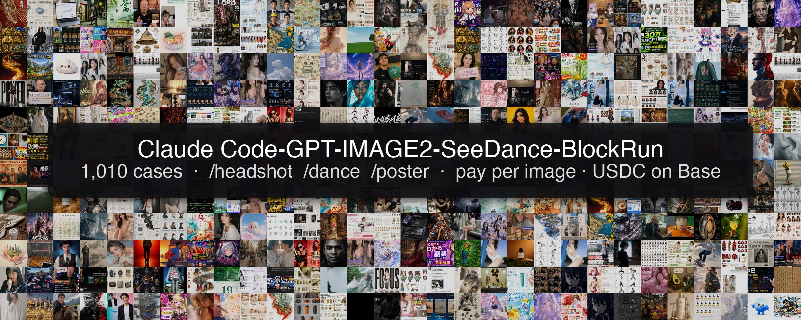

<p align="center">
  <a href="prompts/case-library/INDEX.md"></a>
</p>

<h1 align="center">Claude Code-GPT-IMAGE2-SeeDance-BlockRun</h1>

<p align="center">
  <b>Run any awesome-gpt-image-2 or Seedance prompt as a one-line Claude Code command.</b><br/>
  <code>/headshot</code> · <code>/dance</code> · <code>/poster</code> · 1,010 cases · pay-per-image USDC on Base via <a href="https://blockrun.ai">BlockRun</a>
</p>

<p align="center">
  <a href="https://github.com/BlockRunAI/Claude-Code-GPT-IMAGE2-SeeDance-BlockRun/stargazers"></a>
  
  
  
</p>

---

Other awesome lists tell you what prompt to copy-paste.
This one **runs them for you** — directly from Claude Code, with output
that drops into your project folder, billed by the call (no subscription).

```bash
# One-line install (registers MCP + clones bundle + symlinks /headshot, /dance, /poster)
curl -fsSL https://raw.githubusercontent.com/BlockRunAI/Claude-Code-GPT-IMAGE2-SeeDance-BlockRun/main/install.sh | bash
```

> Prefer not to pipe to bash? Manual two-step lives in [INSTALL.md](INSTALL.md).

Restart Claude Code, fund your BlockRun wallet on first run
(`> top up my blockrun wallet` — takes ~60 seconds), and:

```
> /headshot ./me.jpg
> /dance ./me.jpg --style hiphop
> /poster "Last Light" --genre thriller
```

That's it.

---

## Demo

> The thumbnails below are **real outputs** the underlying models produce —
> served directly from the source `awesome-*` repos (raw URLs, no copies
> stored here). Click through to open the full case file with the prompt,
> attribution, and the X/Twitter post it came from.

<table>
  <tr>
    <td align="center" width="33%"><b>/headshot</b><br/><i>~$0.12 · ~10s</i></td>
    <td align="center" width="33%"><b>/dance</b><br/><i>~$0.75 · 60–180s</i></td>
    <td align="center" width="33%"><b>/poster</b><br/><i>~$0.12 · ~15s</i></td>
  </tr>
  <tr>
    <td align="center"><a href="prompts/case-library/from-awesome-gpt-image-2-prompts/case-16-soft-black-mist-idol-portrait-https-x-com-bubblebrain-status-2046518189509734903-by-bubblebrain-https.md"></a></td>
    <td align="center"><a href="https://pub-babc88c25d274cfeb8b2ae0cd0816872.r2.dev/assets/2-3-1/1/result.mp4"></a></td>
    <td align="center"><a href="prompts/case-library/from-awesome-gpt-image-2-prompts/case-1-boston-spring-2026-city-poster-https-x-com-bubblebrain-status-2045358053831172358-by-bubblebrain-https.md"></a></td>
  </tr>
  <tr>
    <td align="center"><sub>Selfie → studio portrait. 5 styles built-in (corporate, creative, startup, actor, linkedin-2025).</sub></td>
    <td align="center"><sub>Photo → 5-second video. 7 choreography presets including <code>terracotta-disco</code> 兵马俑迪斯科.</sub></td>
    <td align="center"><sub>Title → cinema-grade key art. 8 genres, multilingual title typography.</sub></td>
  </tr>
</table>

---

## What is this

The two big GPT Image 2 awesome lists ([EvoLinkAI](https://github.com/EvoLinkAI/awesome-gpt-image-2-prompts),
[freestylefly](https://github.com/freestylefly/awesome-gpt-image-2)) and the
[awesome-seedance-2-guide](https://github.com/EvoLinkAI/awesome-seedance-2-guide)
are gold mines of viral image / video prompts. But they're **static** —
you copy a prompt, paste it into someone's chat UI, fight with the
upload, and pay through some subscription you never wanted.

This bundle turns them into **executable Claude Code commands**:

- **What you install:** one line of `curl … install.sh | bash` — it
  registers the [BlockRun MCP server](https://github.com/BlockRunAI/blockrun-mcp)
  (`claude mcp add blockrun … npx @blockrun/mcp@latest`), clones the
  bundle to `~/.claude/blockrun-art-bundle/`, and symlinks the three
  skills into `~/.claude/skills/` so they show up as bare `/headshot`,
  `/dance`, `/poster`.
- **What it does:** thin, polished slash commands that pick the right
  model, build a vetted prompt template, call the right MCP tool, and
  drop a file in your project directory. Three commands at v1, more coming.
- **Underneath:** the [BlockRun gateway](https://blockrun.ai) routes to
  OpenAI, ByteDance, xAI, Google, and Z.ai — pay per call in Base USDC
  via x402. No API keys, no subscriptions, no minimums.

```
You type   /headshot ./me.jpg --style startup
            ↓
[this plugin]   picks template + variables, calls
            ↓
mcp__blockrun__blockrun_image    ← from `@blockrun/mcp` (registered via claude mcp add)
            ↓
BlockRun gateway · x402 USDC settle · OpenAI gpt-image-2
            ↓
You get   ./blockrun-out/2026-05-01T143200Z-headshot/headshot.png
```

> Already have BlockRun MCP registered? Skip Step 1 — `claude mcp add`
> is idempotent at the same name and a re-add is harmless.

---

## Commands

### `/headshot` — studio-quality professional photo in 10 seconds

```
/headshot ./me.jpg
/headshot ./me.jpg --style startup
/headshot ./me.jpg --style actor
/headshot ./me.jpg --all          # 4 styles in one go
```

Five built-in styles: `corporate` (default), `creative`, `startup`,
`actor`, `linkedin-2025`. Source identity is preserved 1:1 — only
wardrobe, lighting, and background are restyled.

| Param | Default | Notes |
|---|---|---|
| `image` | required | JPG / PNG / HEIC / WebP, local path or URL |
| `--style` | `corporate` | or `creative`, `startup`, `actor`, `linkedin-2025`, `all` |
| Cost | ~$0.12 | per style; `--all` = ~$0.48 |

Full prompt templates: [`prompts/headshot.md`](prompts/headshot.md) ·
Skill: [`skills/headshot/SKILL.md`](skills/headshot/SKILL.md)

---

### `/dance` — turn any photo into a 5-second dance video

```
/dance ./me.jpg
/dance ./me.jpg --style hiphop
/dance ./me.jpg --style terracotta-disco             # 兵马俑迪斯科
/dance ./me.jpg --style freestyle-from-music \
                --music "lo-fi jazz 75 bpm"
/dance ./me.jpg --duration_seconds 8 --style kpop
```

Six choreography presets: `hiphop`, `ballet`, `contemporary`, `kpop`,
`terracotta-disco`, `tiktok-trend`, plus `freestyle-from-music` for
custom soundtracks. Powered by **ByteDance Seedance 2.0 Fast** (the
price/quality knee — see [`docs/COSTS.md`](docs/COSTS.md)).

Outputs both `dance.mp4` and a shareable looping `dance.gif` (if `ffmpeg`
is installed locally).

| Param | Default | Notes |
|---|---|---|
| `image` | required | full-body or 3/4-body works best |
| `--style` | `tiktok-trend` | one of 7 presets |
| `--duration_seconds` | `5` | range 1–10 |
| `--music` | — | only for `freestyle-from-music` |
| Cost | ~$0.75 | for default 5s; $0.15/sec |

Full prompt templates: [`prompts/dance.md`](prompts/dance.md) ·
Skill: [`skills/dance/SKILL.md`](skills/dance/SKILL.md)

---

### `/poster` — cinema-grade movie / event poster in 15 seconds

```
/poster "Last Light" --genre thriller
/poster "Founders" --genre documentary --tagline "they bet everything"
/poster "BlockRun Live" --genre event --accent_color "#0066ff" --portrait
/poster "兵马俑：复活" --genre sci-fi
/poster "Coffee with the CEO" --genre documentary --square    # podcast cover
```

Eight genre presets: `thriller`, `sci-fi`, `romcom`, `documentary`,
`concert`, `horror`, `kids-animation`, `event`. **gpt-image-2's killer
feature** — multilingual title typography that actually reads correctly,
including CJK / Arabic / Cyrillic.

| Param | Default | Notes |
|---|---|---|
| `title` | required | rendered exactly as typed, multilingual safe |
| `--genre` | `documentary` | one of 8 presets |
| `--tagline`, `--subject`, `--credits` | — | optional polish |
| `--landscape` / `--portrait` / `--square` | landscape | aspect (1792×1024 / 1024×1792 / 1024×1024) |
| Cost | ~$0.12 | per call |

Full prompt templates: [`prompts/poster.md`](prompts/poster.md) ·
Skill: [`skills/poster/SKILL.md`](skills/poster/SKILL.md)

---

## Cost transparency

| Command | Cost | Wall time |
|---|---|---|
| `/headshot` (1 style) | ~$0.12 | ~10 s |
| `/headshot --all` (4 styles) | ~$0.48 | ~40 s |
| `/dance` (5 s, default) | ~$0.75 | 60–180 s |
| `/dance` (10 s, max) | ~$1.50 | 100–240 s |
| `/poster` (any aspect) | ~$0.12 | ~15 s |

**No subscription. No charge if a call times out or fails.** Settled on
Base mainnet USDC via x402. The wallet's private key never leaves
`~/.blockrun/.session` — only signed payment authorizations travel.

A typical creator session ($5 USDC top-up) covers ~40 headshots, or 6 dance
videos, or 40 posters, or any mix. See [`docs/COSTS.md`](docs/COSTS.md)
for the full breakdown of all underlying gateway prices.

---

## Demo gallery — 60 real outputs from the source awesome lists

> All 60 thumbnails below are **real, click-through demos** rendered
> directly from the source `awesome-*` repos via raw URLs (no copies
> stored here, repo stays small). Click any thumbnail to open the
> case file (full prompt, model, attribution, X/Twitter source post).

<!-- GALLERY:START — generated; full curated list at prompts/case-library/GALLERY.md -->
<table>
  <tr>
    <td align="center" width="25%"><a href="prompts/case-library/from-awesome-gpt-image-2-prompts/case-123-water-signs-zodiac-character-poster-https-x-com-komorimedia-status-2048114825398731143-by-komorimedia.md"><br/><sub>Case 123 — Water Signs Zodiac Character Poster</sub></a></td>
    <td align="center" width="25%"><a href="prompts/case-library/from-awesome-gpt-image-2-prompts/case-125-fire-sign-zodiac-character-poster-https-x-com-komorimedia-status-2048114825398731143-by-komorimedia-h.md"><br/><sub>Case 125 — Fire Sign Zodiac Character Poster</sub></a></td>
    <td align="center" width="25%"><a href="prompts/case-library/from-awesome-gpt-image-2-prompts/case-124-earth-signs-zodiac-character-poster-https-x-com-komorimedia-status-2048114825398731143-by-komorimedia.md"><br/><sub>Case 124 — Earth Signs Zodiac Character Poster</sub></a></td>
    <td align="center" width="25%"><a href="prompts/case-library/from-awesome-gpt-image-2-prompts/case-126-air-sign-zodiac-character-poster-https-x-com-komorimedia-status-2048114825398731143-by-komorimedia-ht.md"><br/><sub>Case 126 — Air Sign Zodiac Character Poster</sub></a></td>
  </tr>
  <tr>
    <td align="center" width="25%"><a href="prompts/case-library/from-awesome-gpt-image-2-prompts/case-16-soft-black-mist-idol-portrait-https-x-com-bubblebrain-status-2046518189509734903-by-bubblebrain-https.md"><br/><sub>Case 16 — Soft Black Mist Idol Portrait</sub></a></td>
    <td align="center" width="25%"><a href="prompts/case-library/from-awesome-gpt-image-2/235.md"><br/><sub>例 235：治愈系助眠指南九宫格</sub></a></td>
    <td align="center" width="25%"><a href="prompts/case-library/from-awesome-gpt-image-2-prompts/case-128-vintage-prs-guitar-lineage-poster-https-x-com-glennhasabeard-status-2048087784141857235-by-glennhasabe.md"><br/><sub>Case 128 — Vintage PRS Guitar Lineage Poster</sub></a></td>
    <td align="center" width="25%"><a href="prompts/case-library/from-awesome-gpt-image-2/199.md"><br/><sub>例 199：超写实海滩高角度手机自拍</sub></a></td>
  </tr>
  <tr>
    <td align="center" width="25%"><a href="prompts/case-library/from-awesome-gpt-image-2-prompts/case-162-good-bath-day-editorial-poster-https-x-com-kazuch75240438-status-2048205418238030327-by-kazuch75240438.md"><br/><sub>Case 162 — Good Bath Day Editorial Poster</sub></a></td>
    <td align="center" width="25%"><a href="prompts/case-library/from-awesome-gpt-image-2/119.md"><br/><sub>例 119：主题海报版式设计</sub></a></td>
    <td align="center" width="25%"><a href="prompts/case-library/from-awesome-gpt-image-2/367-velora.md"><br/><sub>例 367：VELORA 奢华香水广告海报</sub></a></td>
    <td align="center" width="25%"><a href="prompts/case-library/from-awesome-gpt-image-2-prompts/case-101-anime-fantasy-travel-movie-poster-https-x-com-design4p0-status-2047531978346398002-by-design4p0-https.md"><br/><sub>Case 101 — Anime Fantasy Travel Movie Poster</sub></a></td>
  </tr>
  <tr>
    <td align="center" width="25%"><a href="prompts/case-library/from-awesome-gpt-image-2/88.md"><br/><sub>例 88：信息图可视化设计</sub></a></td>
    <td align="center" width="25%"><a href="prompts/case-library/from-awesome-gpt-image-2-prompts/case-100-cyberpunk-404-witch-summoning-https-x-com-eris-create-lab-status-2047537707904274795-by-eris-create-la.md"><br/><sub>Case 100 — Cyberpunk 404 Witch Summoning</sub></a></td>
    <td align="center" width="25%"><a href="prompts/case-library/from-awesome-gpt-image-2-prompts/case-112-anime-character-brand-identity-merch-board-https-x-com-chi-vc-status-2046061073720369228-by-chi-vc.md"><br/><sub>Case 112: [Anime Character Brand Identity & Merch Board](htt</sub></a></td>
    <td align="center" width="25%"><a href="prompts/case-library/from-awesome-gpt-image-2/175.md"><br/><sub>例 175：封面排版设计图</sub></a></td>
  </tr>
  <tr>
    <td align="center" width="25%"><a href="prompts/case-library/from-awesome-gpt-image-2-prompts/case-145-neon-nike-lumina-ad-poster-https-x-com-alwavenazca-status-2048147643809865950-by-alwavenazca-https.md"><br/><sub>Case 145 — Neon Nike Lumina Ad Poster</sub></a></td>
    <td align="center" width="25%"><a href="prompts/case-library/from-awesome-gpt-image-2-prompts/case-73-cyberpunk-ai-tools-comparison-poster-https-x-com-movehiro1219-status-2047698611665096732-by-movehiro121.md"><br/><sub>Case 73 — Cyberpunk AI Tools Comparison Poster</sub></a></td>
    <td align="center" width="25%"><a href="prompts/case-library/from-awesome-gpt-image-2-prompts/case-109-vr-headset-exploded-view-poster-https-x-com-wory37303852-status-2045925660401795478-by-wory37303852-h.md"><br/><sub>Case 109 — VR Headset Exploded View Poster</sub></a></td>
    <td align="center" width="25%"><a href="prompts/case-library/from-awesome-gpt-image-2-prompts/case-141-soft-pastel-anime-girl-full-body-https-x-com-hoshi122221-status-2048025730425196801-by-hoshi122221-ht.md"><br/><sub>Case 141 — Soft Pastel Anime Girl Full Body</sub></a></td>
  </tr>
  <tr>
    <td align="center" width="25%"><a href="prompts/case-library/from-awesome-gpt-image-2/343.md"><br/><sub>例 343：高定时尚杂志封面</sub></a></td>
    <td align="center" width="25%"><a href="prompts/case-library/from-awesome-gpt-image-2-prompts/case-71-streetwear-fashion-campaign-asian-apparel-poster-https-x-com-harboriis-status-2047921293123895520-by-ha.md"><br/><sub>Case 71 — Streetwear Fashion Campaign Asian Apparel Poster</sub></a></td>
    <td align="center" width="25%"><a href="prompts/case-library/from-awesome-gpt-image-2-prompts/case-15-fujifilm-strawberry-school-portrait-https-x-com-bubblebrain-status-2046483268019884384-by-bubblebrain.md"><br/><sub>Case 15 — Fujifilm Strawberry School Portrait</sub></a></td>
    <td align="center" width="25%"><a href="prompts/case-library/from-awesome-gpt-image-2-prompts/case-92-monochrome-hermes-inspired-avatar-https-x-com-jiajia232016-status-2048044100793032976-by-jiajia232016.md"><br/><sub>Case 92 — Monochrome Hermes-Inspired Avatar</sub></a></td>
  </tr>
  <tr>
    <td align="center" width="25%"><a href="prompts/case-library/from-awesome-gpt-image-2/275.md"><br/><sub>例 275：一张采用分层蒙太奇构图的电影海报</sub></a></td>
    <td align="center" width="25%"><a href="prompts/case-library/from-awesome-gpt-image-2-prompts/case-137-gas-giant-descent-storyboard-https-x-com-xrahultripathi-status-2048140775356354892-by-xrahultripathi.md"><br/><sub>Case 137 — Gas Giant Descent Storyboard</sub></a></td>
    <td align="center" width="25%"><a href="prompts/case-library/from-awesome-gpt-image-2-prompts/case-108-high-fashion-beverage-campaign-board-https-x-com-speedai07-status-2049713995851202786-by-speedai07-ht.md"><br/><sub>Case 108 — High-Fashion Beverage Campaign Board</sub></a></td>
    <td align="center" width="25%"><a href="prompts/case-library/from-awesome-gpt-image-2-prompts/case-167-pastel-jellyfish-room-goods-poster-https-x-com-ayu-ai-0912-status-2048309565817766139-by-ayu-ai-0912.md"><br/><sub>Case 167 — Pastel Jellyfish Room Goods Poster</sub></a></td>
  </tr>
  <tr>
    <td align="center" width="25%"><a href="prompts/case-library/from-awesome-gpt-image-2-prompts/case-119-biomimetic-skyray-aircraft-poster-https-x-com-simonsmith-status-2048172203946996041-by-simonsmith-h.md"><br/><sub>Case 119 — Biomimetic Skyray Aircraft Poster</sub></a></td>
    <td align="center" width="25%"><a href="prompts/case-library/from-awesome-gpt-image-2-prompts/case-159-e-commerce-main-image-pastel-blue-crocs-fashion-ad-https-x-com-speedai07-status-2047907058079650035-by.md"><br/><sub>Case 159 — E-commerce Main Image - Pastel Blue Crocs Fashion</sub></a></td>
    <td align="center" width="25%"><a href="prompts/case-library/from-awesome-gpt-image-2-prompts/case-129-alishan-one-day-travel-poster-https-x-com-twnese-status-2048077204786212887-by-twnese-https-x-com-t.md"><br/><sub>Case 129 — Alishan One-Day Travel Poster</sub></a></td>
    <td align="center" width="25%"><a href="prompts/case-library/from-awesome-gpt-image-2/296.md"><br/><sub>例 296：博物馆级中文拆解信息图鉴</sub></a></td>
  </tr>
  <tr>
    <td align="center" width="25%"><a href="prompts/case-library/from-awesome-gpt-image-2/219.md"><br/><sub>例 219：韩系偶像九宫格写真集</sub></a></td>
    <td align="center" width="25%"><a href="prompts/case-library/from-awesome-gpt-image-2-prompts/case-142-urban-fantasy-coexistence-crossing-https-x-com-ray-crown0-status-2048024227664494775-by-ray-crown0-ht.md"><br/><sub>Case 142 — Urban Fantasy Coexistence Crossing</sub></a></td>
    <td align="center" width="25%"><a href="prompts/case-library/from-awesome-gpt-image-2-prompts/case-102-anime-music-bootcamp-promo-poster-https-x-com-sorane-aimusic-status-2047507066697507134-by-sorane-aimu.md"><br/><sub>Case 102 — Anime Music Bootcamp Promo Poster</sub></a></td>
    <td align="center" width="25%"><a href="prompts/case-library/from-awesome-gpt-image-2-prompts/case-120-artist-and-ethereal-muse-at-night-https-x-com-almimeister-status-2048309710118687101-by-almimeister-h.md"><br/><sub>Case 120 — Artist and Ethereal Muse at Night</sub></a></td>
  </tr>
  <tr>
    <td align="center" width="25%"><a href="prompts/case-library/from-awesome-gpt-image-2-prompts/case-4-35mm-flash-editorial-portrait-https-x-com-bubblebrain-status-2045052982728016131-by-bubblebrain-https.md"><br/><sub>Case 4 — 35mm Flash Editorial Portrait</sub></a></td>
    <td align="center" width="25%"><a href="prompts/case-library/from-awesome-gpt-image-2-prompts/case-146-streetwear-sneaker-poster-ad-https-x-com-alwavenazca-status-2048147643809865950-by-alwavenazca-https.md"><br/><sub>Case 146 — Streetwear Sneaker Poster Ad</sub></a></td>
    <td align="center" width="25%"><a href="prompts/case-library/from-awesome-gpt-image-2-prompts/case-117-cinematic-chicken-momos-ad-poster-https-x-com-diplomeme-status-2048060325925470358-by-diplomeme-https.md"><br/><sub>Case 117 — Cinematic Chicken Momos Ad Poster</sub></a></td>
    <td align="center" width="25%"><a href="prompts/case-library/from-awesome-gpt-image-2-prompts/case-13-korean-idol-3x3-collage-portrait-https-x-com-bubblebrain-status-2046151898621993364-by-bubblebrain-htt.md"><br/><sub>Case 13 — Korean Idol 3x3 Collage Portrait</sub></a></td>
  </tr>
  <tr>
    <td align="center" width="25%"><a href="prompts/case-library/from-awesome-gpt-image-2/321.md"><br/><sub>例 321：都市落日时尚大片</sub></a></td>
    <td align="center" width="25%"><a href="prompts/case-library/from-awesome-gpt-image-2-prompts/case-3-japanese-onsen-ryokan-portrait-https-x-com-bubblebrain-status-2045092449803284923-by-bubblebrain-https.md"><br/><sub>Case 3 — Japanese Onsen Ryokan Portrait</sub></a></td>
    <td align="center" width="25%"><a href="prompts/case-library/from-awesome-gpt-image-2-prompts/case-156-e-commerce-main-image-sustainable-t-shirt-plantable-tag-ad-https-x-com-diplomeme-status-2047957339974828.md"><br/><sub>Case 156 — E-commerce Main Image - Sustainable T-Shirt Plant</sub></a></td>
    <td align="center" width="25%"><a href="prompts/case-library/from-awesome-gpt-image-2/74.md"><br/><sub>例 74：关系图谱信息图</sub></a></td>
  </tr>
  <tr>
    <td align="center" width="25%"><a href="prompts/case-library/from-awesome-gpt-image-2-prompts/case-94-pastel-lavender-anime-girl-portrait-https-x-com-libearal-status-2048026376645861799-by-libearal-https.md"><br/><sub>Case 94 — Pastel Lavender Anime Girl Portrait</sub></a></td>
    <td align="center" width="25%"><a href="prompts/case-library/from-awesome-gpt-image-2/124.md"><br/><sub>例 124：主题海报版式设计</sub></a></td>
    <td align="center" width="25%"><a href="prompts/case-library/from-awesome-gpt-image-2-prompts/case-172-monochrome-fashion-cover-https-x-com-sha-zdiii-status-2049088961008848905-by-sha-zdiii-https-x-com.md"><br/><sub>Case 172 — Monochrome Fashion Cover</sub></a></td>
    <td align="center" width="25%"><a href="prompts/case-library/from-awesome-gpt-image-2/341-ap-calculus.md"><br/><sub>例 341：AP Calculus 学习表信息图</sub></a></td>
  </tr>
  <tr>
    <td align="center" width="25%"><a href="prompts/case-library/from-awesome-gpt-image-2/372.md"><br/><sub>例 372：可爱角色设定表</sub></a></td>
    <td align="center" width="25%"><a href="prompts/case-library/from-awesome-gpt-image-2-prompts/case-121-vintage-claude-shannon-infographic-poster-https-x-com-mob-17-status-2048118645017219381-by-mob-17-htt.md"><br/><sub>Case 121 — Vintage Claude Shannon Infographic Poster</sub></a></td>
    <td align="center" width="25%"><a href="prompts/case-library/from-awesome-gpt-image-2/71.md"><br/><sub>例 71：关系图谱信息图</sub></a></td>
    <td align="center" width="25%"><a href="prompts/case-library/from-awesome-gpt-image-2/240.md"><br/><sub>例 240：胶片闪光灯下的球场少女</sub></a></td>
  </tr>
  <tr>
    <td align="center" width="25%"><a href="prompts/case-library/from-awesome-gpt-image-2/224.md"><br/><sub>例 224：机甲少女立于废弃海城</sub></a></td>
    <td align="center" width="25%"><a href="prompts/case-library/from-awesome-gpt-image-2/355-prompt.md"><br/><sub>例 355：概念字体海报 Prompt</sub></a></td>
    <td align="center" width="25%"><a href="prompts/case-library/from-awesome-gpt-image-2/305.md"><br/><sub>例 305：深夜便利店里的性感霓虹少女</sub></a></td>
    <td align="center" width="25%"><a href="prompts/case-library/from-awesome-gpt-image-2/222.md"><br/><sub>例 222：精致模块化科普百科图鉴</sub></a></td>
  </tr>
  <tr>
    <td align="center" width="25%"><a href="prompts/case-library/from-awesome-gpt-image-2-prompts/case-107-anime-band-finale-at-budokan-https-x-com-sdai1807097011-status-2048127178592915583-by-sdai1807097011.md"><br/><sub>Case 107 — Anime Band Finale at Budokan</sub></a></td>
    <td align="center" width="25%"><a href="prompts/case-library/from-awesome-gpt-image-2-prompts/portrait-photography-cases.md"><br/><sub>🍌 Portrait & Photography Cases</sub></a></td>
    <td align="center" width="25%"><a href="prompts/case-library/from-awesome-gpt-image-2-prompts/case-91-spanish-grwm-morning-beauty-thumbnail-https-x-com-s0n-ia-status-2047414367243657296-by-s0n-ia-https.md"><br/><sub>Case 91 — Spanish GRWM Morning Beauty Thumbnail</sub></a></td>
    <td align="center" width="25%"><a href="prompts/case-library/from-awesome-gpt-image-2-prompts/case-147-editorial-osaka-six-sweatshirt-ad-https-x-com-laurentb-status-2048126606313464040-by-laurentb-https.md"><br/><sub>Case 147 — Editorial Osaka Six Sweatshirt Ad</sub></a></td>
  </tr>
</table>
<!-- GALLERY:END -->

**Want the full 700+ case catalog?** See [`prompts/case-library/INDEX.md`](prompts/case-library/INDEX.md) — grouped by tag and source repo.

### Full case library

| Workflow | Cases |
|---|---|
| Text → image | 268 |
| Text → video | 106 |
| Image → image (edit) | 322 |
| Image → video | 27 |
| **Total** | **723** unique cases (96% with hero image attached) |

Every case is a single markdown file with normalized frontmatter (title,
source, credit, workflow, model, tags) plus the original demo image
embedded. See [`prompts/case-library/INDEX.md`](prompts/case-library/INDEX.md)
for the full browseable catalog grouped by tag and source.

> v1 ships with 3 polished slash commands (`/headshot`, `/dance`,
> `/poster`). The 700+ cases above are the runway for v1.1+ — each tag in
> the index is a candidate slash command in waiting.

| Vibe | Source | One-line command |
|---|---|---|
| Studio Ghibli portrait | awesome-gpt-image-2 | `/headshot ./me.jpg --style ghibli` (v1.1) |
| 9-grid character sheet | awesome-gpt-image-2-prompts | `/character-sheet "Hua, terracotta scout"` (v1.1) |
| Glassmorphism UI mock | awesome-gpt-image-2 | `/ui-system social --style glass` (v1.1) |
| Movie poster (thriller) | this bundle | `/poster "Last Light" --genre thriller` |
| 5-second dance loop | awesome-seedance-2-guide | `/dance ./me.jpg --style tiktok-trend` |
| K-pop stage clip | awesome-seedance-2-guide | `/dance ./me.jpg --style kpop` |
| LinkedIn "promoted" headshot | awesome-gpt-image-2-prompts | `/headshot ./me.jpg --style linkedin-2025` |
| Podcast cover (square) | this bundle | `/poster "Coffee with the CEO" --square` |
| ... | ... | ... |

---

## Why Claude Code + BlockRun

- **Native CC integration.** No browser, no copy-paste, no separate
  tools. Slash commands inside the editor you already use.
- **Pay per call.** $0.12 here, $0.75 there. Stop when you're done. Top
  up when you want. No "10 free generations a month, then $20/mo".
- **Multi-model under one roof.** GPT Image 2 for typography. Seedance
  for video. DALL-E 3 / Nano Banana / Grok / CogView available too —
  switch with one parameter.
- **Crypto-native, but invisible.** Base USDC is the rails, but you only
  see USD prices. Your wallet auto-creates on first use. Top up with
  any wallet that speaks Base.
- **Deterministic outputs.** Files land in your project directory. Easy
  to commit (don't), share, post, or feed into the next stage of your
  pipeline.

---

## Roadmap

| Version | Commands |
|---|---|
| **v1.0** (this release) | `/headshot`, `/dance`, `/poster` |
| v1.1 | `/character-sheet`, `/ui-system`, `/ghibli` |
| v1.2 | `/lookbook`, `/ad-series`, `/card-deck`, `/unbox` |
| v2.0 | `/blockrun-art generate "<free description>"` smart router; full case-library executable as discoverable subcommands |

Want to influence what comes next? Open an issue or vote in the
discussions: [github.com/BlockRunAI/Claude-Code-GPT-IMAGE2-SeeDance-BlockRun](https://github.com/BlockRunAI/Claude-Code-GPT-IMAGE2-SeeDance-BlockRun).

---

## Credits

The viral prompt patterns in `prompts/case-library/` were curated from:

- **[EvoLinkAI/awesome-gpt-image-2-prompts](https://github.com/EvoLinkAI/awesome-gpt-image-2-prompts)** — text-to-image and image-to-image template gold mine
- **[freestylefly/awesome-gpt-image-2](https://github.com/freestylefly/awesome-gpt-image-2)** — image-to-image edits, style transfers, character consistency
- **[EvoLinkAI/awesome-seedance-2-guide](https://github.com/EvoLinkAI/awesome-seedance-2-guide)** — Seedance text-to-video and image-to-video case studies

Each case file under `prompts/case-library/from-*/` includes
`source_url` and `credit` in its frontmatter — go give those repos a star.

The underlying gateway is **[BlockRun.ai](https://blockrun.ai)** — x402
micropayments on Base, no subscriptions, no API keys.

---

## License

MIT — see [`LICENSE`](LICENSE). Cases under `prompts/case-library/from-*/`
retain the licenses of their original repositories (all three are
MIT-compatible at the time of this release).

---

<details>
<summary>SEO keywords (for indexing)</summary>

claude code, claude code skill, claude code plugin, claude code marketplace,
gpt-image-2, gpt image 2, openai gpt image, dall-e 3, nano banana,
seedance, seedance 2.0, seedance 1.5, bytedance video, bytedance ai video,
blockrun, blockrun.ai, blockrun mcp, x402, x402 micropayments,
USDC base, base mainnet, base usdc payments,
ai image generation, ai image generator, ai video generation, ai video generator,
image to video, img2vid, image-to-image edit, photo to video,
headshot generator, ai headshot, professional headshot ai, linkedin photo ai,
movie poster generator, ai movie poster, film poster ai, key art ai,
dance video generator, ai dance video, tiktok dance ai, viral dance video,
viral ai prompts, awesome gpt image 2, awesome seedance,
mcp server, model context protocol, claude mcp,
character sheet ai, ui mockup ai, ghibli style ai, kpop video ai

</details>
