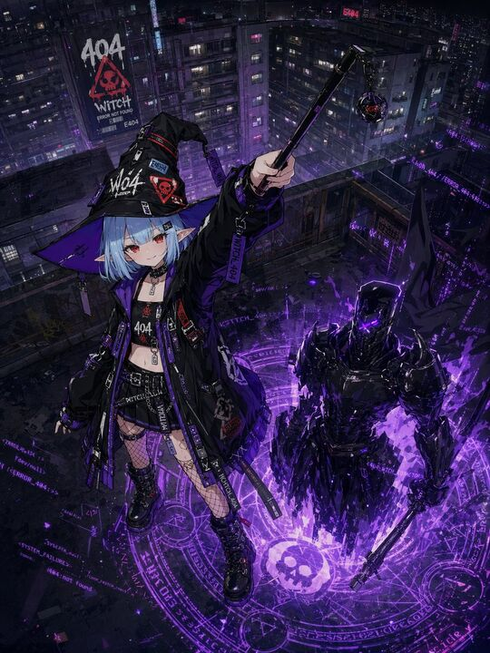

## Original prompt

A dramatic anime-style cyberpunk witch standing on a dark rooftop high above a dense futuristic city at night, viewed from a slightly elevated angle. The main subject is a petite young witch girl with pale skin, short icy blue bobbed hair, pointed elf-like ears, and glowing red eyes, wearing a sly confident smile. She raises a black wand overhead in her right hand, with a dangling orb charm at the tip glowing faintly purple and red. Her oversized crooked witch hat is black with purple lining and covered in stitched patches, warning labels, straps, and white graphics including a large “404” and a skull emblem. She wears a black and purple techwear outfit: oversized hooded jacket with many straps and tags, black crop top with “404” on the chest, layered belts, short bottoms, fishnet on one leg, black lace-up combat boots, chokers, and metallic accessories. Several hanging straps and tags visibly read words like “WITCH 404,” “404,” and glitch-themed markings. Beneath and beside her, a large glowing violet magic circle mixed with hacker interface aesthetics is projected on the rooftop floor, filled with occult rings, sigils, a central skull symbol, and scattered neon system text such as error-code fragments, creating a fusion of sorcery and digital corruption. Emerging from the circle is 1 large armored summoned figure: a black futuristic demon-knight or robotic familiar with jagged reflective armor, a narrow purple-lit visor, and a heavy weapon held in one hand, partially dissolving into purple energy shards and smoke. The background shows a sprawling rainy megacity of apartment towers and industrial rooftops, packed with windows, balconies, cables, signs, and haze. On a nearby building wall is a giant vertical graffiti-style sign with 3 readable elements: “404”, “Witch”, and “ERROR NOT FOUND”, plus a smaller “E404”. Additional purple neon glitch text and symbols are scattered across rooftops and in the air. Use a dark palette of black, indigo, and deep violet with sharp magenta-purple highlights, cinematic contrast, reflective wet surfaces, dense detail, and a high-end polished illustration style. The mood is occult, edgy, stylish, and dangerous, combining urban fantasy, hacker aesthetics, and magical summoning.

## Run via Claude Code

After installing `Claude Code-GPT-IMAGE2-SeeDance-BlockRun`, you can adapt this case
into one of the bundle's commands. Closest match for this case based on
detected tags: `/poster`.

```text
# Suggested invocation (manual prompt — wire into a command in v1.1+)
> Use the prompt above with mcp__blockrun__blockrun_image, model=openai/gpt-image-2,
  action=generate.
```

## Credit & license

Sourced from [awesome-gpt-image-2-prompts](https://github.com/EvoLinkAI/awesome-gpt-image-2-prompts/blob/main/cases/ui.md) by EvoLinkAI.
This case file is part of the curated `prompts/case-library/` in the
[Claude Code-GPT-IMAGE2-SeeDance-BlockRun](https://github.com/BlockRunAI/Claude-Code-GPT-IMAGE2-SeeDance-BlockRun)
bundle. Reproduced with attribution; original license applies.
