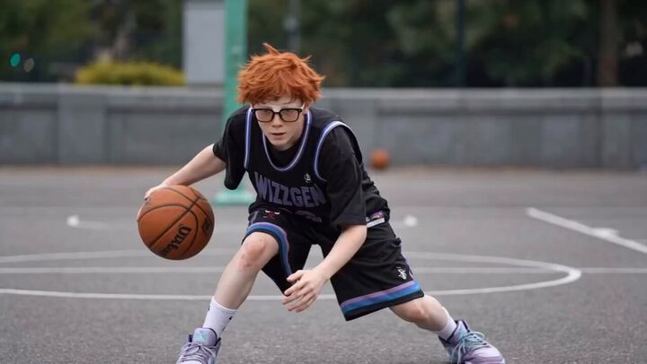

## Original prompt

A soft anime-style bedroom portrait of {argument name="character name" default="Nekomata Okayu"}, shown from the chest up sitting on a bed at night, centered in the frame. She has short fluffy {argument name="hair color" default="lavender"} hair with layered bangs partially covering one eye, large cat ears on top of her head with white inner fur, and a cute sleepy catgirl appearance. Her expression is gentle and relaxed, with one hand raised near her cheek in a shy, cozy pose. She wears oversized {argument name="pajama color" default="light lavender"} button-up pajamas with dark purple piping, a small chest pocket, and paw-print shaped buttons and paw-print decoration on the pocket. The room is lit with dreamy purple ambient lighting. In the background, show a nighttime window with a crescent moon and stars visible outside, soft curtains, a bedside table with a glowing cat-shaped lamp, a neatly rumpled bed with pillows and blankets in matching purple tones, and a small framed wall picture featuring a simple cat face and hearts. Use a cute pastel palette, soft shading, polished digital anime rendering, subtle highlights in the hair, intimate cozy composition, and a calm bedtime atmosphere.

## Run via Claude Code

After installing `Claude Code-GPT-IMAGE2-SeeDance-BlockRun`, you can adapt this case
into one of the bundle's commands. Closest match for this case based on
detected tags: `/headshot`.

```text
# Suggested invocation (manual prompt — wire into a command in v1.1+)
> Use the prompt above with mcp__blockrun__blockrun_image, model=openai/gpt-image-2,
  action=generate.
```

## Credit & license

Sourced from [awesome-gpt-image-2-prompts](https://github.com/EvoLinkAI/awesome-gpt-image-2-prompts/blob/main/cases/portrait.md) by EvoLinkAI.
This case file is part of the curated `prompts/case-library/` in the
[Claude Code-GPT-IMAGE2-SeeDance-BlockRun](https://github.com/BlockRunAI/Claude-Code-GPT-IMAGE2-SeeDance-BlockRun)
bundle. Reproduced with attribution; original license applies.
