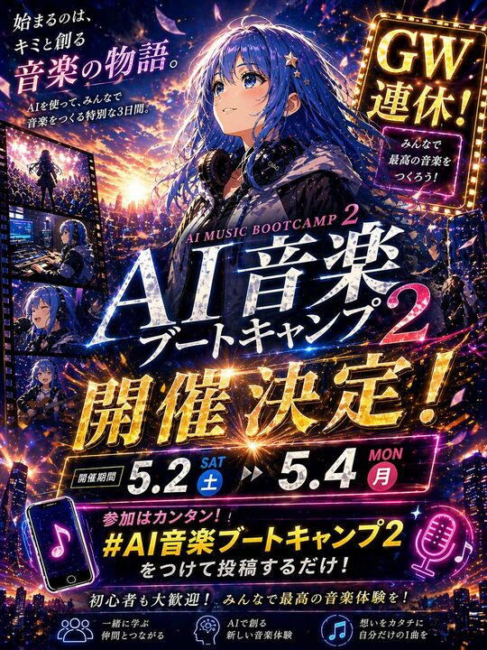

## Original prompt

Create a dramatic Japanese anime-style promotional thumbnail poster for an event, vertical 4:5 composition, ultra-detailed, cinematic, neon-lit, high contrast, designed like a social media announcement image. The main subject is a beautiful anime girl centered slightly right, shown from the waist up, with long flowing {argument name="hair color" default="deep blue"} hair blowing in the wind, decorated with small star hairpins, wearing a dark hoodie and large studio headphones around her neck, against a glowing sunset-to-night city skyline filled with sparkling lights, music-energy particles, lens flares, and flying glowing petals. Her face area is obscured by a soft rectangular blur block. Use a vivid palette of electric blue, violet, magenta, gold, and sunset orange. Fill the design with layered Japanese typography that is crisp, readable, and integrated into the art like a polished event advertisement. Include exactly 8 major text groups: top left copy reading 「始まるのは、キミと創る 音楽の物語。」 with a smaller subcopy beneath reading 「AIを使って、みんなで音楽をつくる特別な3日間。」; top right a glowing marquee sign reading 「GW連休!」 and a smaller neon box below reading 「みんなで最高の音楽をつくろう!」; center main title with small English text 「AI MUSIC BOOTCAMP 2」 above huge Japanese title text 「AI音楽 ブートキャンプ 2」; a gigantic gold metallic announcement across the middle reading 「開催決定!」; a date bar reading 「開催期間」 followed by 「5.2 SAT 土」 and 「5.4 MON 月」; a hashtag callout near the bottom reading 「参加はカンタン!! #AI音楽ブートキャンプ2 をつけて投稿するだけ!」; a lower encouragement line reading 「初心者も大歓迎! みんなで最高の音楽体験を!」; and 3 bottom feature captions with icons reading 「一緒に学ぶ 仲間とつながる」, 「AIで創る 新しい音楽体験」, and 「想いをカタチに 自分だけの1曲を」. On the left edge, add a vertical filmstrip with exactly 4 inset panels showing the same girl in music-related scenes: 1) performing on a stage before a crowd, 2) working at a music production desk with screens and equipment, 3) singing into a microphone, 4) playing an acoustic guitar. Add exactly 2 neon music-themed icon illustrations in the lower area: a tilted smartphone with a music note on the lower left and a glowing microphone with musical notes on the lower right. Make the text effects glossy, luminous, and embossed with gold and white highlights, with energetic streaks and spark explosions around the headline. The overall feeling should be inspiring, celebratory, futuristic, and emotionally uplifting, like a high-impact Japanese Golden Week music bootcamp ad for {argument name="event name" default="AI音楽ブートキャンプ 2"}.

## Run via Claude Code

After installing `Claude Code-GPT-IMAGE2-SeeDance-BlockRun`, you can adapt this case
into one of the bundle's commands. Closest match for this case based on
detected tags: `/poster`.

```text
# Suggested invocation (manual prompt — wire into a command in v1.1+)
> Use the prompt above with mcp__blockrun__blockrun_image, model=openai/gpt-image-2,
  action=generate.
```

## Credit & license

Sourced from [awesome-gpt-image-2-prompts](https://github.com/EvoLinkAI/awesome-gpt-image-2-prompts/blob/main/cases/ui.md) by EvoLinkAI.
This case file is part of the curated `prompts/case-library/` in the
[Claude Code-GPT-IMAGE2-SeeDance-BlockRun](https://github.com/BlockRunAI/Claude-Code-GPT-IMAGE2-SeeDance-BlockRun)
bundle. Reproduced with attribution; original license applies.
