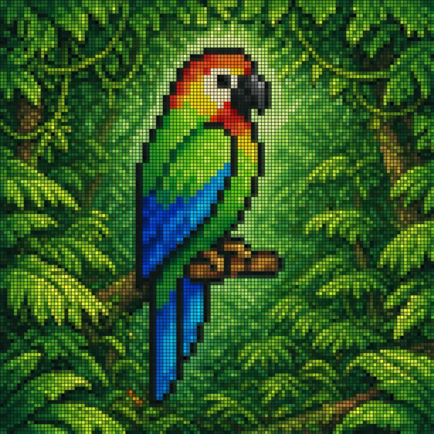

## Original prompt

A vibrant pixel-art style mosaic of a tropical parrot perched on a small brown branch in the middle of dense rainforest foliage. The entire image is rendered as a tight grid of tiny square tiles with visible black outlines, creating a stained-glass or LED-screen effect. The bird is shown in side profile facing right, with a large curved black beak, a pale cream face, a bright red-orange forehead and throat, vivid green upper body, and long wings and tail in saturated blue and cyan. The surrounding jungle is filled edge to edge with layered green leaves in many shades, with a soft light green glow behind the parrot to separate it from the background. High color contrast, rich tropical palette, crisp tile pattern, centered composition, decorative digital mosaic aesthetic.

## Run via Claude Code

After installing `Claude Code-GPT-IMAGE2-SeeDance-BlockRun`, you can adapt this case
into one of the bundle's commands. Closest match for this case based on
detected tags: `/ui-system (v1.1)`.

```text
# Suggested invocation (manual prompt — wire into a command in v1.1+)
> Use the prompt above with mcp__blockrun__blockrun_image, model=openai/gpt-image-2,
  action=generate.
```

## Credit & license

Sourced from [awesome-gpt-image-2-prompts](https://github.com/EvoLinkAI/awesome-gpt-image-2-prompts/blob/main/cases/ui.md) by EvoLinkAI.
This case file is part of the curated `prompts/case-library/` in the
[Claude Code-GPT-IMAGE2-SeeDance-BlockRun](https://github.com/BlockRunAI/Claude-Code-GPT-IMAGE2-SeeDance-BlockRun)
bundle. Reproduced with attribution; original license applies.
