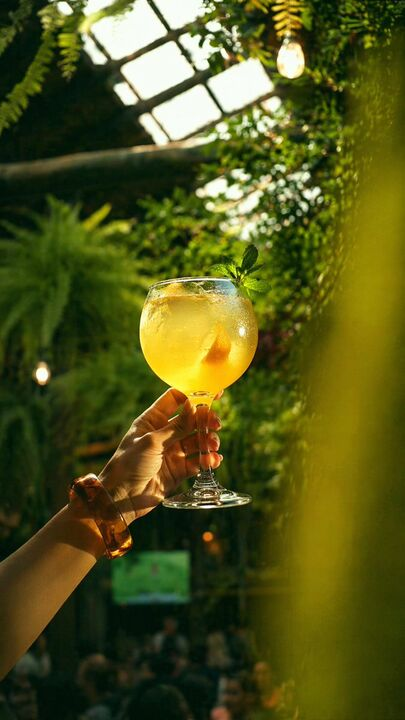

## Original prompt

A cinematic vertical photo of a hand holding up a large balloon wine glass filled with a sparkling golden-yellow citrus cocktail in a lush indoor greenhouse bar. The drink is backlit by warm late-afternoon sunlight, making it glow translucent amber. Inside the glass there is 1 visible citrus wedge, and at the rim there is 1 fresh mint garnish cluster. The hand enters from the lower left, delicately gripping the stem, wearing 1 chunky translucent amber bracelet. The setting is dense with tropical greenery, hanging ferns, and vine-covered walls, with a bright greenhouse roof structure visible overhead and 2 warm exposed hanging bulbs softly glowing in the background. Use shallow depth of field with creamy bokeh, strong sun rays filtering through leaves, soft haze, and rich green-and-gold color contrast. Add a blurred foreground leaf or plant along the right edge to frame the composition. The lower background should suggest a busy café or cocktail lounge with indistinct people, but keep them heavily out of focus. Photorealistic, elegant lifestyle photography, moody yet sun-drenched, shot from a low angle looking upward at the raised glass, high detail on condensation, glass reflections, and the luminous drink.

## Run via Claude Code

After installing `Claude Code-GPT-IMAGE2-SeeDance-BlockRun`, you can adapt this case
into one of the bundle's commands. Closest match for this case based on
detected tags: `/poster`.

```text
# Suggested invocation (manual prompt — wire into a command in v1.1+)
> Use the prompt above with mcp__blockrun__blockrun_image, model=openai/gpt-image-2,
  action=generate.
```

## Credit & license

Sourced from [awesome-gpt-image-2-prompts](https://github.com/EvoLinkAI/awesome-gpt-image-2-prompts/blob/main/cases/ui.md) by EvoLinkAI.
This case file is part of the curated `prompts/case-library/` in the
[Claude Code-GPT-IMAGE2-SeeDance-BlockRun](https://github.com/BlockRunAI/Claude-Code-GPT-IMAGE2-SeeDance-BlockRun)
bundle. Reproduced with attribution; original license applies.
