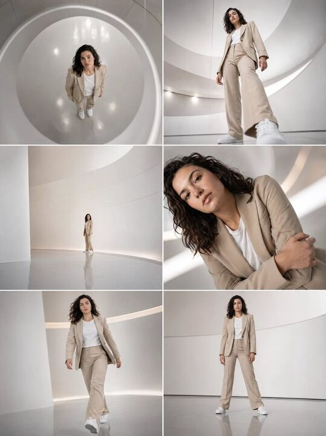

## Original prompt

Frame 1 (Top-Down Establishing)
Extreme top-down shot in futuristic white curved hall, subject centered but compressed against smooth reflective floor, body aligned straight but slightly angled, arms close to body with subtle tension, head tilted upward toward camera, gaze directed straight up, strong circular architectural lines framing composition, soft studio lighting creating gentle gradients, shallow depth of field at f/1.2, smartphone-like proximity despite height, clean minimal atmosphere, dynamic opening frame, subtle athletic readiness, wearing full beige suit with white t-shirt and white sleek sneakers, Peter Lindbergh influence
Frame 2 (Low Angle Power)
Extreme low angle from floor level, subject towering above camera, legs forming strong base, torso slightly leaning forward, shoulders squared, arms slightly away from body, head angled downward, gaze into lens, strong vertical distortion, reflective floor amplifying silhouette, soft studio lighting with controlled highlights, shallow depth f/1.2, powerful dominance frame, subtle athletic tension, full beige suit, white t-shirt, white sleek sneakers, Peter Lindbergh influence
Frame 3 (Wide Isolation)
Wide long shot, subject very small within vast futuristic hall, surrounded by curved white architecture, large negative space dominating composition, subject standing still, body straight, arms relaxed but structured, head slightly turned, gaze outward into space, minimal reflections, soft even lighting, shallow depth f/1.2 isolating subject despite distance, cinematic silence, full beige suit, white t-shirt, white sleek sneakers, Peter Lindbergh influence
Frame 4 (Dynamic Close-Up Tilt)
Close-up with strong diagonal tilt, subject leaning into frame, shoulders sharply angled, one arm crossing body, head tilted sideways, gaze slightly off camera, tight crop cutting part of body, soft lighting wrapping contours, shallow depth f/1.2 isolating face plane, intense proximity and tension, full beige suit, white t-shirt visible, Peter Lindbergh influence
Frame 5 (Motion Step Forward)
Mid shot, subject stepping forward dynamically, one leg extended, weight shifting, arms slightly swinging with controlled motion, shoulders rotated, head facing forward, gaze ahead, slight motion blur on edges, futuristic curved walls passing behind, soft studio lighting, shallow depth f/1.2, transitional energy frame, full beige suit, white t-shirt, white sleek sneakers, Peter Lindbergh influence
Frame 6 (Final Grounded Frame)
Full body frontal shot, subject standing firmly, legs slightly apart, arms held with controlled tension, shoulders squared, head facing forward, gaze into camera, symmetrical composition slightly offset, minimal futuristic background, soft lighting emphasizing structure, shallow depth f/1.2, strong final impact frame, subtle athletic readiness, full beige suit, white t-shirt, white sleek sneakers, Peter Lindbergh influence

Negative Commands (apply to all frames):
no text, no watermark, no low quality, no cartoonish style

Aspect Ratio: 3:4

## Run via Claude Code

After installing `Claude Code-GPT-IMAGE2-SeeDance-BlockRun`, you can adapt this case
into one of the bundle's commands. Closest match for this case based on
detected tags: `/ui-system (v1.1)`.

```text
# Suggested invocation (manual prompt — wire into a command in v1.1+)
> Use the prompt above with mcp__blockrun__blockrun_image, model=openai/gpt-image-2,
  action=generate.
```

## Credit & license

Sourced from [awesome-gpt-image-2-prompts](https://github.com/EvoLinkAI/awesome-gpt-image-2-prompts/blob/main/README.md) by EvoLinkAI.
This case file is part of the curated `prompts/case-library/` in the
[Claude Code-GPT-IMAGE2-SeeDance-BlockRun](https://github.com/BlockRunAI/Claude-Code-GPT-IMAGE2-SeeDance-BlockRun)
bundle. Reproduced with attribution; original license applies.
