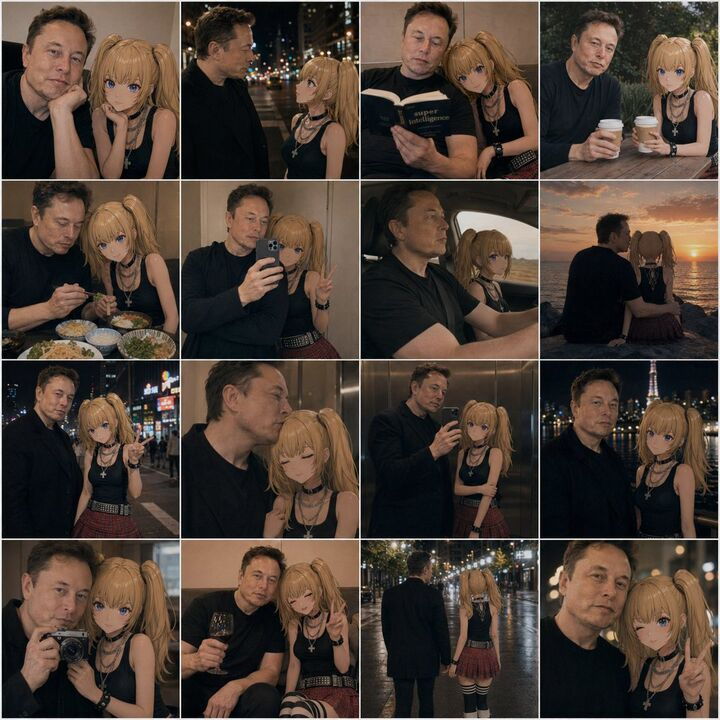

## Original prompt

A 4x4 photo collage of 16 warm, cinematic lifestyle snapshots featuring a real adult man and an anime-style young woman companion posed together as if in casual date photos. The man has short dark hair, light skin, an average build, and wears a plain dark navy or black long-sleeve shirt; his face is intentionally obscured and softly blurred in every frame. The anime girl has long blonde twin ponytails, large blue eyes, light skin, and a slim petite build, wearing a black sleeveless top, layered silver necklaces including a cross pendant, black wrist accessories, a red plaid pleated mini skirt, and black-and-white striped thigh-high socks. Blend realistic photography with a convincingly integrated 2D anime character, keeping her clean cel-shaded look while matching the scene lighting, perspective, focus, and color grading so she appears naturally present beside him. Use moody evening tones, soft bokeh, shallow depth of field, and intimate candid couple energy. The 16 panels are: 1) close indoor portrait with both seated close together, the girl resting beside him; 2) nighttime city street side profile conversation under blurred streetlights; 3) indoors, both reading a book together, the girl leaning on his shoulder; 4) outdoor cafe table, both holding takeaway coffee cups; 5) restaurant table with multiple dishes visible, dining together; 6) mirror selfie in an elevator, the man holding a smartphone while the girl makes a peace sign; 7) car interior road-trip shot, the man driving and the anime girl in the passenger seat; 8) seaside sunset from behind, both sitting side by side watching the ocean; 9) neon-lit city night portrait, the girl pointing toward the camera; 10) intimate elevator close-up, the girl with eyes closed leaning affectionately against him; 11) full mirror selfie in an elevator showing more of both outfits; 12) night city skyline portrait with a lit tower in the background; 13) camera selfie close-up, the man holding a compact camera toward a mirror or reflective surface; 14) cozy indoor lounge moment, the man holding a glass of red wine while the girl smiles and makes a peace sign; 15) rear full-body rainy night street shot, the pair walking away hand in hand under glowing streetlights; 16) extreme close-up night portrait with the girl flashing a peace sign. Keep the collage tightly gridded with thin white dividers, square overall format, consistent amber-brown color grading, romantic urban realism, and subtle social-media photo-dump aesthetics.

## Run via Claude Code

After installing `Claude Code-GPT-IMAGE2-SeeDance-BlockRun`, you can adapt this case
into one of the bundle's commands. Closest match for this case based on
detected tags: `/headshot`.

```text
# Suggested invocation (manual prompt — wire into a command in v1.1+)
> Use the prompt above with mcp__blockrun__blockrun_image, model=openai/gpt-image-2,
  action=generate.
```

## Credit & license

Sourced from [awesome-gpt-image-2-prompts](https://github.com/EvoLinkAI/awesome-gpt-image-2-prompts/blob/main/cases/ui.md) by EvoLinkAI.
This case file is part of the curated `prompts/case-library/` in the
[Claude Code-GPT-IMAGE2-SeeDance-BlockRun](https://github.com/BlockRunAI/Claude-Code-GPT-IMAGE2-SeeDance-BlockRun)
bundle. Reproduced with attribution; original license applies.
