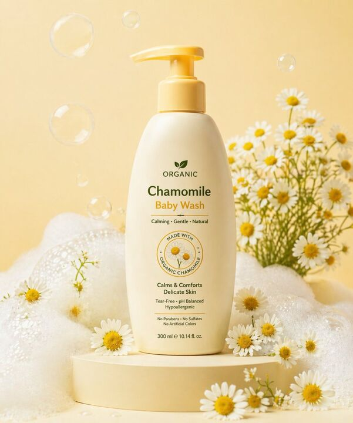

## Original prompt

A soft {argument name="bottle color" default="cream-colored"} bottle with a {argument name="pump color" default="pastel yellow"} pump stands on a matte podium, surrounded by silky foam and {argument name="flowers" default="chamomile blossoms"}. The background is a pale yellow gradient with subtle bubble details. The label emphasizes organic chamomile and calming care. Fresh chamomile flowers accentuate the gentle appeal.

## Run via Claude Code

After installing `Claude Code-GPT-IMAGE2-SeeDance-BlockRun`, you can adapt this case
into one of the bundle's commands. Closest match for this case based on
detected tags: `/ui-system (v1.1)`.

```text
# Suggested invocation (manual prompt — wire into a command in v1.1+)
> Use the prompt above with mcp__blockrun__blockrun_image, model=openai/gpt-image-2,
  action=generate.
```

## Credit & license

Sourced from [awesome-gpt-image-2-prompts](https://github.com/EvoLinkAI/awesome-gpt-image-2-prompts/blob/main/cases/ecommerce.md) by EvoLinkAI.
This case file is part of the curated `prompts/case-library/` in the
[Claude Code-GPT-IMAGE2-SeeDance-BlockRun](https://github.com/BlockRunAI/Claude-Code-GPT-IMAGE2-SeeDance-BlockRun)
bundle. Reproduced with attribution; original license applies.
