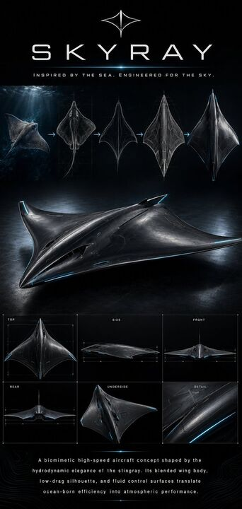

## Original prompt

{"type":"biomimetic aerospace concept poster","subject":{"vehicle":"futuristic aircraft concept","name":"{argument name=\"vehicle name\" default=\"SKYRAY\"}","inspiration":"{argument name=\"animal inspiration\" default=\"stingray\"}","design":"blended-wing-body aircraft shaped like a manta ray or stingray, wide triangular planform, smooth organic curves, sharp pointed nose, slightly raised central spine, tapered wing tips curling subtly upward, dark graphite-black metallic skin with fine panel lines and faint blue illuminated accents along edges and seams"},"style":{"mood":"premium futuristic industrial design presentation","rendering":"hyper-detailed cinematic 3D concept art mixed with blueprint visualization","color_palette":"black, charcoal, gunmetal, silver, deep ocean blue, electric cyan highlights","lighting":"low-key dramatic studio lighting with glossy reflections, cool rim light, subtle underwater ambience in the top inspiration strip"},"layout":{"background":"full black poster with faint technical grid lines and soft vignetting","sections":[{"title":"header","position":"top","count":3,"labels":["emblem mark","SKYRAY","INSPIRED BY THE SEA. ENGINEERED FOR THE SKY."]},{"title":"evolution strip","position":"upper middle","count":5,"labels":["realistic stingray underwater at far left","top-view biological stingray study","abstract aerodynamic line sketch","faceted aircraft blueprint transition drawing","final sleek aircraft concept at far right"]},{"title":"hero render","position":"center","count":1,"labels":["large three-quarter view of the aircraft"]},{"title":"technical views grid","position":"lower middle","count":6,"labels":["TOP","SIDE","FRONT","REAR","UNDERSIDE","DETAIL"]},{"title":"footer text","position":"bottom","count":1,"labels":["{argument name=\"body text\" default=\"A biomimetic high-speed aircraft concept shaped by the hydrodynamic elegance of the stingray. Its blended wing body, low-drag silhouette, and fluid control surfaces translate ocean-born efficiency into atmospheric performance.\"}"]}],"technical views":{"TOP":"top orthographic view with measurement ticks","SIDE":"thin side profile with long smooth belly curve","FRONT":"front orthographic view emphasizing broad wingspan and central cockpit hump","REAR":"rear orthographic view showing narrow tail end and wing sweep","UNDERSIDE":"underside three-quarter view","DETAIL":"close-up crop of metallic skin, seam lines, and glowing blue edge strip"}},"graphics":{"logo":"minimal four-point symmetrical emblem above title, resembling a stylized ray silhouette","arrows":"4 thin cyan arrows connecting the 5 stages in the evolution strip","typography":"widely spaced modern sans-serif uppercase text, clean luxury-tech branding"},"camera":{"hero render":"slightly elevated front-left three-quarter angle","technical views":"orthographic","inspiration image":"underwater side angle with light rays from above"},"quality":"ultra-clean, polished, high contrast, sharp, poster-ready, concept design board for aerospace branding or speculative industrial design"}

## Run via Claude Code

After installing `Claude Code-GPT-IMAGE2-SeeDance-BlockRun`, you can adapt this case
into one of the bundle's commands. Closest match for this case based on
detected tags: `/poster`.

```text
# Suggested invocation (manual prompt — wire into a command in v1.1+)
> Use the prompt above with mcp__blockrun__blockrun_image, model=openai/gpt-image-2,
  action=generate.
```

## Credit & license

Sourced from [awesome-gpt-image-2-prompts](https://github.com/EvoLinkAI/awesome-gpt-image-2-prompts/blob/main/cases/poster.md) by EvoLinkAI.
This case file is part of the curated `prompts/case-library/` in the
[Claude Code-GPT-IMAGE2-SeeDance-BlockRun](https://github.com/BlockRunAI/Claude-Code-GPT-IMAGE2-SeeDance-BlockRun)
bundle. Reproduced with attribution; original license applies.
