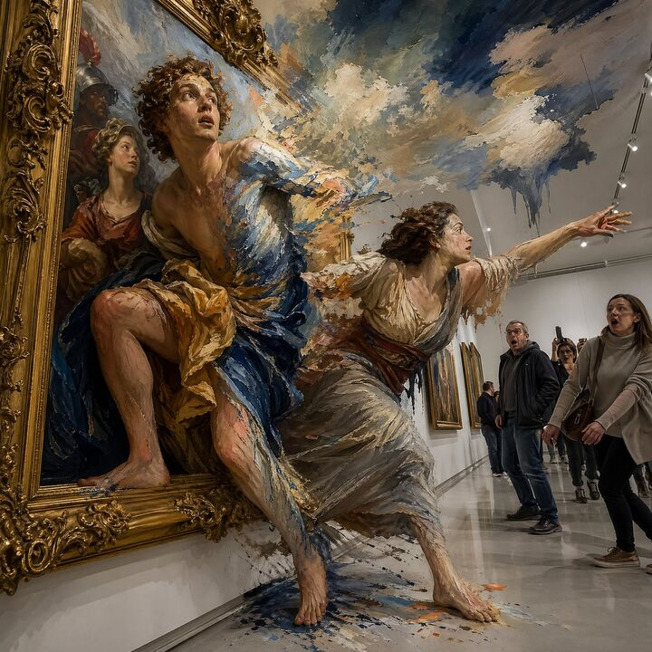

## Original prompt

A {argument name="painting style" default="baroque oil painting"} comes to life — its painted figures climbing out of the gilded frame into a {argument name="setting" default="modern white gallery"}, half their bodies still in flat 2D paint, half fully volumetric 3D humans, brushstrokes visible on their skin, the painting's background leaking watercolor clouds into the gallery ceiling, museum visitors frozen in shock, hyper-detailed, {argument name="artist influence" default="René Magritte meets Pixar"}, reality fracturing at every boundary

## Run via Claude Code

After installing `Claude Code-GPT-IMAGE2-SeeDance-BlockRun`, you can adapt this case
into one of the bundle's commands. Closest match for this case based on
detected tags: `(case-library only — no v1 command match)`.

```text
# Suggested invocation (manual prompt — wire into a command in v1.1+)
> Use the prompt above with mcp__blockrun__blockrun_image, model=openai/gpt-image-2,
  action=generate.
```

## Credit & license

Sourced from [awesome-gpt-image-2-prompts](https://github.com/EvoLinkAI/awesome-gpt-image-2-prompts/blob/main/cases/poster.md) by EvoLinkAI.
This case file is part of the curated `prompts/case-library/` in the
[Claude Code-GPT-IMAGE2-SeeDance-BlockRun](https://github.com/BlockRunAI/Claude-Code-GPT-IMAGE2-SeeDance-BlockRun)
bundle. Reproduced with attribution; original license applies.
