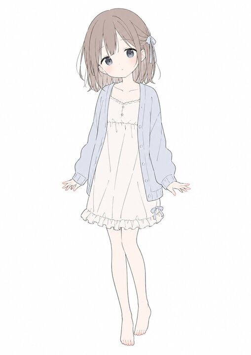

## Original prompt

A full-body anime girl character design on a plain white background, centered and floating slightly, drawn in a soft minimalist pastel style with very thin gray linework and delicate flat colors. She has a petite youthful build and a cute, gentle silhouette, with special emphasis on a soft rounded face shape, smooth cheeks, and a softened jawline and chin. Her face is completely obscured by a blank skin-colored rectangular block with no facial features visible. She has short bob hair in {argument name="hair color" default="light ash brown"}, slightly tousled with wispy ends, long bangs covering part of the forehead, and a small ribbon hair tie on the right side in pale blue-gray. She wears 3 visible clothing pieces: an oversized pale blue cardigan with loose sleeves and front buttons, a cream-white slip dress with a scalloped neckline and a tiny button detail at the chest, and a frilled hem with a small ribbon near the right thigh. She is barefoot with slim pale legs, posed front-facing with both arms relaxed slightly outward, open hands, one leg straight and the other gently bent inward for a shy, weightless look. The illustration should feel airy, cute, understated, and clean, like a simple Japanese anime fashion sketch, with lots of negative space and no props, no shadows, and no background elements.

## Run via Claude Code

After installing `Claude Code-GPT-IMAGE2-SeeDance-BlockRun`, you can adapt this case
into one of the bundle's commands. Closest match for this case based on
detected tags: `/poster`.

```text
# Suggested invocation (manual prompt — wire into a command in v1.1+)
> Use the prompt above with mcp__blockrun__blockrun_image, model=openai/gpt-image-2,
  action=generate.
```

## Credit & license

Sourced from [awesome-gpt-image-2-prompts](https://github.com/EvoLinkAI/awesome-gpt-image-2-prompts/blob/main/cases/poster.md) by EvoLinkAI.
This case file is part of the curated `prompts/case-library/` in the
[Claude Code-GPT-IMAGE2-SeeDance-BlockRun](https://github.com/BlockRunAI/Claude-Code-GPT-IMAGE2-SeeDance-BlockRun)
bundle. Reproduced with attribution; original license applies.
