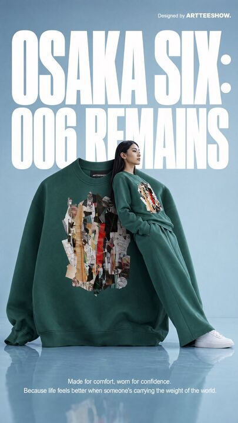

## Original prompt

A clean editorial fashion advertisement poster on a pale powder-blue studio background with a glossy reflective floor. The composition is vertical and minimal, dominated by oversized bold white condensed sans-serif typography in the background reading “OSAKA SIX:” on the top line and “006 REMAINS” below, filling most of the upper half behind the subject. In the top right corner, small white branding text reads “Designed by ARTTEESHOW.” Centered in the lower middle is an oversized forest-green crewneck sweatshirt standing upright like a sculptural object, with soft heavy cotton fabric, dropped shoulders, extra-long sleeves pooled on the floor, and a small black neck label that reads ARTTEESHOW. On the chest of the sweatshirt is a large abstract collage print made from torn paper fragments in beige, tan, black, gray, white, and vivid red, arranged vertically like layered scraps. Leaning against the right side of the giant sweatshirt is a slim female fashion model with long straight black hair, wearing a matching {argument name="sweatshirt color" default="forest green"} sweatshirt and relaxed wide-leg sweatpants with clean white low-top sneakers. She is posed in profile with a calm detached editorial attitude, one hand in her pocket, her body reclining diagonally against the giant garment, legs extended forward; her face is obscured by a soft rectangular blur for an anonymous art-fashion look. The smaller worn sweatshirt has the same abstract torn-paper collage graphic centered on the chest. At the bottom center, add 2 lines of small white copy text: “Made for comfort, worn for confidence.” and “Because life feels better when someone’s carrying the weight of the world.” The image should feel like a premium conceptual streetwear campaign from the early 1990s reimagined as contemporary luxury advertising, with crisp studio lighting, soft shadows, subtle floor reflections, precise product focus, surreal scale contrast between the oversized sweatshirt and the model, and a polished magazine-poster aesthetic.

## Run via Claude Code

After installing `Claude Code-GPT-IMAGE2-SeeDance-BlockRun`, you can adapt this case
into one of the bundle's commands. Closest match for this case based on
detected tags: `/poster`.

```text
# Suggested invocation (manual prompt — wire into a command in v1.1+)
> Use the prompt above with mcp__blockrun__blockrun_image, model=openai/gpt-image-2,
  action=generate.
```

## Credit & license

Sourced from [awesome-gpt-image-2-prompts](https://github.com/EvoLinkAI/awesome-gpt-image-2-prompts/blob/main/cases/ad-creative.md) by EvoLinkAI.
This case file is part of the curated `prompts/case-library/` in the
[Claude Code-GPT-IMAGE2-SeeDance-BlockRun](https://github.com/BlockRunAI/Claude-Code-GPT-IMAGE2-SeeDance-BlockRun)
bundle. Reproduced with attribution; original license applies.
