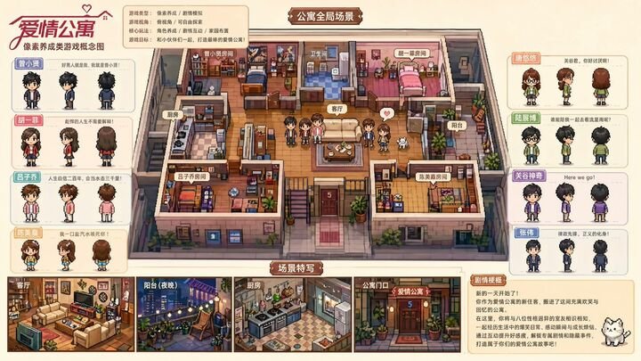

## Original prompt

爱情公寓 电视剧主题 像素养成类游戏概念图，包括场景全局内容，周围环绕各人物形象三视图，底部是场景特写，右下角是剧情梗概。

随机一个经典国内古装电视剧，生成古装电视剧主题像素养成类游戏概念图，包括场景全局内容，周围环绕各人物形象三视图，底部是场景特写，右下角是剧情梗概。

「XXX」电视剧主题像素养成类游戏概念图，包括场景全局内容，周围环绕各人物（人物别重复）形象三视图，底部是场景特写，右下角是剧情梗概。

## Run via Claude Code

After installing `Claude Code-GPT-IMAGE2-SeeDance-BlockRun`, you can adapt this case
into one of the bundle's commands. Closest match for this case based on
detected tags: `/character-sheet (v1.1)`.

```text
# Suggested invocation (manual prompt — wire into a command in v1.1+)
> Use the prompt above with mcp__blockrun__blockrun_image, model=openai/gpt-image-2,
  action=generate.
```

## Credit & license

Sourced from [awesome-gpt-image-2-prompts](https://github.com/EvoLinkAI/awesome-gpt-image-2-prompts/blob/main/cases/character.md) by EvoLinkAI.
This case file is part of the curated `prompts/case-library/` in the
[Claude Code-GPT-IMAGE2-SeeDance-BlockRun](https://github.com/BlockRunAI/Claude-Code-GPT-IMAGE2-SeeDance-BlockRun)
bundle. Reproduced with attribution; original license applies.
