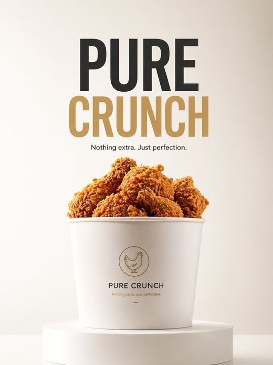

## Original prompt

A minimalist product advertisement with a {argument name="product" default="fried chicken bucket"} placed on a clean white podium.

Background: soft gradient ({argument name="background gradient" default="light cream to white"}), clean studio.

Lighting: soft diffused, premium Apple-style.

Typography (center): “{argument name="headline" default="PURE CRUNCH"}”

Small text below: “Nothing extra. Just perfection.”

Style: ultra clean, editorial minimal, high-end branding, 8K.

## Run via Claude Code

After installing `Claude Code-GPT-IMAGE2-SeeDance-BlockRun`, you can adapt this case
into one of the bundle's commands. Closest match for this case based on
detected tags: `/ui-system (v1.1)`.

```text
# Suggested invocation (manual prompt — wire into a command in v1.1+)
> Use the prompt above with mcp__blockrun__blockrun_image, model=openai/gpt-image-2,
  action=generate.
```

## Credit & license

Sourced from [awesome-gpt-image-2-prompts](https://github.com/EvoLinkAI/awesome-gpt-image-2-prompts/blob/main/cases/ecommerce.md) by EvoLinkAI.
This case file is part of the curated `prompts/case-library/` in the
[Claude Code-GPT-IMAGE2-SeeDance-BlockRun](https://github.com/BlockRunAI/Claude-Code-GPT-IMAGE2-SeeDance-BlockRun)
bundle. Reproduced with attribution; original license applies.
