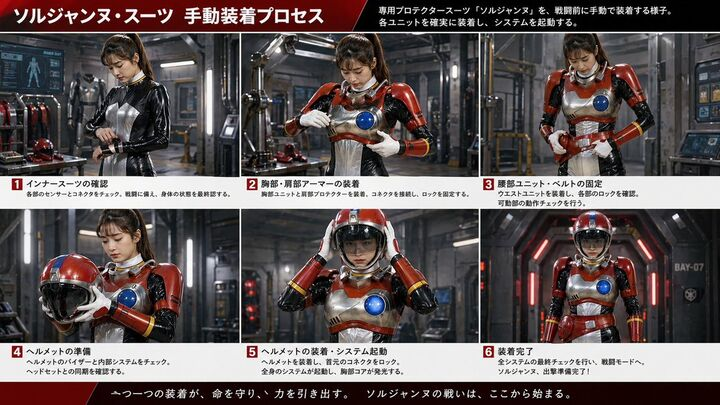

## Original prompt

Prompt 1: Create a cinematic hero image of a gourmet cheeseburger on a dark stone surface with glossy brioche bun, melted cheese, crisp lettuce, tomato, grilled patty, sauce, realistic texture, appetizing steam, warm side light, shallow depth of field, premium food commercial style, no text/logos/watermark.

Prompt 2: Create a 9-cell hybrid keyframe-to-transition storyboard sheet for a 15-second gourmet burger ad, moving from empty surface to ingredient assembly to final macro hero shot. Use large S cells and smaller T cells, motion arrows, ghosted ingredient positions, steam, sauce trails, and camera push-in icons. Style: premium food commercial, warm lighting, rich texture, appetizing, cinematic, minimal labels only. No logos, no watermark.

## Run via Claude Code

After installing `Claude Code-GPT-IMAGE2-SeeDance-BlockRun`, you can adapt this case
into one of the bundle's commands. Closest match for this case based on
detected tags: `/ui-system (v1.1)`.

```text
# Suggested invocation (manual prompt — wire into a command in v1.1+)
> Use the prompt above with mcp__blockrun__blockrun_image, model=openai/gpt-image-2,
  action=edit.
```

## Credit & license

Sourced from [awesome-gpt-image-2-prompts](https://github.com/EvoLinkAI/awesome-gpt-image-2-prompts/blob/main/README.md) by EvoLinkAI.
This case file is part of the curated `prompts/case-library/` in the
[Claude Code-GPT-IMAGE2-SeeDance-BlockRun](https://github.com/BlockRunAI/Claude-Code-GPT-IMAGE2-SeeDance-BlockRun)
bundle. Reproduced with attribution; original license applies.
