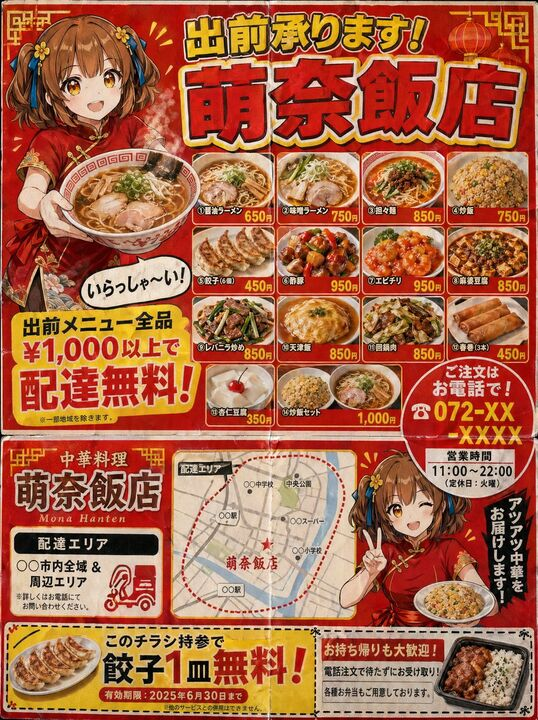

## Original prompt

A Japanese neighborhood Chinese restaurant delivery flyer for mailbox posting (3:4 aspect ratio). Designed to look like a double-sided B5 print.

Flyer characteristics (following the grammar of real delivery flyers):
- Flashy red and yellow color scheme.
- Large text at the top: "Delivery Available! {argument name="shop name" default="Mona-Hanten"}" (shadowed Gothic font).
- An illustration of a {argument name="character" default="Chinese girl in a red cheongsam with a brown short bob"} holding ramen and saying "Welcome!" in a speech bubble.
- A menu photo grid (4x3) featuring various dishes: different types of ramen, fried rice, gyoza, sweet and sour pork, shrimp in chili sauce, mapo tofu, liver and leek stir-fry, tenshinhan, twice-cooked pork, spring rolls, annin tofu, and fried rice sets.
- Names and prices for each dish.
- A large yellow banner saying "Free delivery on all menu items over ¥1,000!".
- "Order by phone! ☎ 072-XX-XXXX" emphasized with a red circle.
- Business hours "11:00-22:00 (Closed on Tuesdays)".
- Delivery area map (simple schematic map).
- Coupon (perforated line for clipping): "One free plate of gyoza with this flyer!".

Texture of cheap paper printing. Includes fold marks. Precision that could be mistaken for a real Japanese delivery flyer.

## Run via Claude Code

After installing `Claude Code-GPT-IMAGE2-SeeDance-BlockRun`, you can adapt this case
into one of the bundle's commands. Closest match for this case based on
detected tags: `/ad-series (v1.2)`.

```text
# Suggested invocation (manual prompt — wire into a command in v1.1+)
> Use the prompt above with mcp__blockrun__blockrun_image, model=openai/gpt-image-2,
  action=generate.
```

## Credit & license

Sourced from [awesome-gpt-image-2-prompts](https://github.com/EvoLinkAI/awesome-gpt-image-2-prompts/blob/main/cases/ad-creative.md) by EvoLinkAI.
This case file is part of the curated `prompts/case-library/` in the
[Claude Code-GPT-IMAGE2-SeeDance-BlockRun](https://github.com/BlockRunAI/Claude-Code-GPT-IMAGE2-SeeDance-BlockRun)
bundle. Reproduced with attribution; original license applies.
