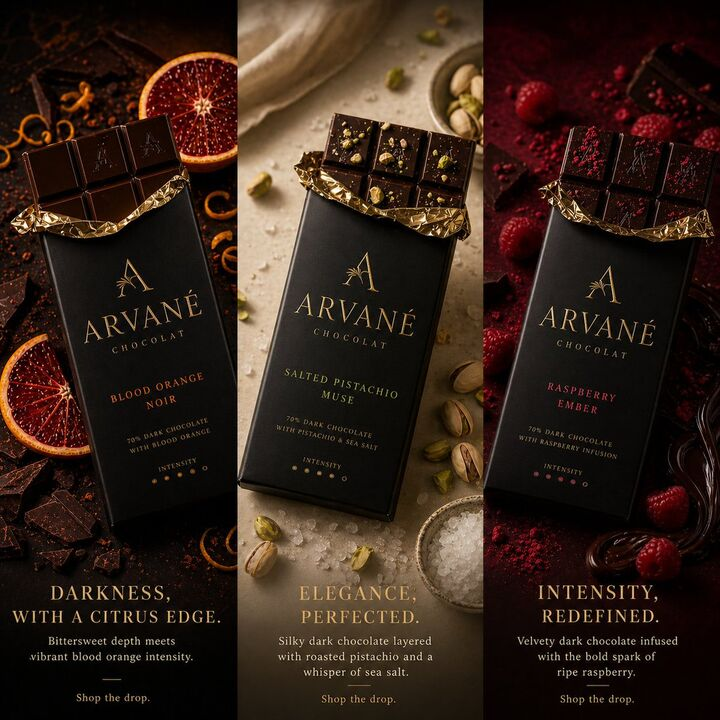

## Original prompt

Ultra-realistic satellite view from space, a clean modern editorial layout of 9 vertical panels arranged side-by-side on a white background, together forming the word "MADPENCIL", each panel containing one letter created entirely from natural Earth topography, no artificial text overlays:

Panel 1 (M): rugged mountain ranges and deep valleys forming a sharp, angular "M", rocky textures, high elevation shadows
Panel 2 (A): winding river cutting through dense green forest forming an organic "A", strong contrast between water and vegetation
Panel 3 (D): desert dunes and wind-sculpted sand patterns shaping a smooth "D", warm tones, soft gradients
Panel 4 (P): agricultural farmland grids and patchwork fields forming a structured "P", geometric patterns clearly visible
Panel 5 (E): glacier and ice formations carving a crisp "E", bright whites and icy blues, fractured textures
Panel 6 (N): braided river system across floodplains forming "N", branching channels with natural flow lines
Panel 7 (C): coastal shoreline and ocean edge shaping a curved "C", waves and sediment gradients visible
Panel 8 (I): narrow canyon or straight river cutting through terrain forming a minimal "I", strong vertical emphasis
Panel 9 (L): volcanic terrain with lava flows forming an "L", dark rock with glowing red/orange lava accents

top-down satellite perspective, NASA Earth observation style, hyper-detailed textures, realistic geography, consistent scale and lighting across all panels, minimal clouds, high contrast, sharp focus, subtle atmospheric haze, natural color grading, ultra high resolution 8K, clean spacing between panels, modern gallery-style composition, visually cohesive but each panel distinctly different biome, letters clearly readable yet organically integrated into terrain

## Run via Claude Code

After installing `Claude Code-GPT-IMAGE2-SeeDance-BlockRun`, you can adapt this case
into one of the bundle's commands. Closest match for this case based on
detected tags: `/ad-series (v1.2)`.

```text
# Suggested invocation (manual prompt — wire into a command in v1.1+)
> Use the prompt above with mcp__blockrun__blockrun_image, model=openai/gpt-image-2,
  action=generate.
```

## Credit & license

Sourced from [awesome-gpt-image-2-prompts](https://github.com/EvoLinkAI/awesome-gpt-image-2-prompts/blob/main/cases/poster.md) by EvoLinkAI.
This case file is part of the curated `prompts/case-library/` in the
[Claude Code-GPT-IMAGE2-SeeDance-BlockRun](https://github.com/BlockRunAI/Claude-Code-GPT-IMAGE2-SeeDance-BlockRun)
bundle. Reproduced with attribution; original license applies.
