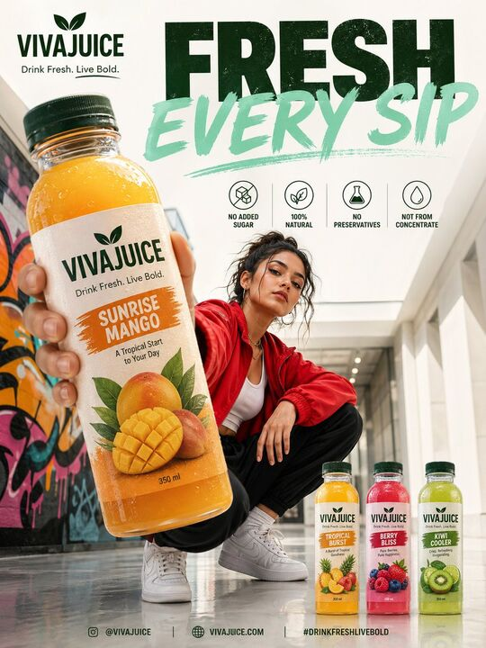

## Original prompt

A high-end café-style product photograph of a transparent glass filled with iced coffee, centered against a soft beige and cream seamless studio background. The drink shows a rich dark coffee base blending with creamy milk swirls, creating a smooth gradient effect. Several clear ice cubes are visible with realistic transparency and light refraction. The glass has subtle condensation droplets, adding freshness. Soft natural studio lighting creates delicate highlights and a clean shadow beneath the glass. Ultra-sharp focus, premium beverage advertisement style, DSLR macro photography, hyper realistic, 8K.

PROMPT 2 - Create a hyper-realistic exploded vertical infographic composition of an iced coffee.

Top → Bottom structure:
Foam Layer (light creamy foam with soft airy texture)
→ Coffee Liquid (rich dark espresso layer with smooth gradient)
→ Ice Cubes (transparent cubes with sharp edges and reflections)
→ Milk Layer (soft creamy white layer with smooth blend effect)
→ Glass Base (clear minimal glass structure)

All elements must be perfectly centered, evenly spaced, and aligned vertically. Use a soft beige seamless background with clean café-style lighting and subtle realistic shadows beneath each floating element. The composition should feel like a premium beverage ad combined with a clean infographic layout.

Add clean minimalist text labels with thin pointer lines using these exact labels:
“Foam”
“Coffee”
“Ice”
“Milk”
“Glass”
Ultra-realistic liquid detail, sharp reflections, premium commercial photography, 8K.

## Run via Claude Code

After installing `Claude Code-GPT-IMAGE2-SeeDance-BlockRun`, you can adapt this case
into one of the bundle's commands. Closest match for this case based on
detected tags: `/ui-system (v1.1)`.

```text
# Suggested invocation (manual prompt — wire into a command in v1.1+)
> Use the prompt above with mcp__blockrun__blockrun_image, model=openai/gpt-image-2,
  action=generate.
```

## Credit & license

Sourced from [awesome-gpt-image-2-prompts](https://github.com/EvoLinkAI/awesome-gpt-image-2-prompts/blob/main/cases/poster.md) by EvoLinkAI.
This case file is part of the curated `prompts/case-library/` in the
[Claude Code-GPT-IMAGE2-SeeDance-BlockRun](https://github.com/BlockRunAI/Claude-Code-GPT-IMAGE2-SeeDance-BlockRun)
bundle. Reproduced with attribution; original license applies.
