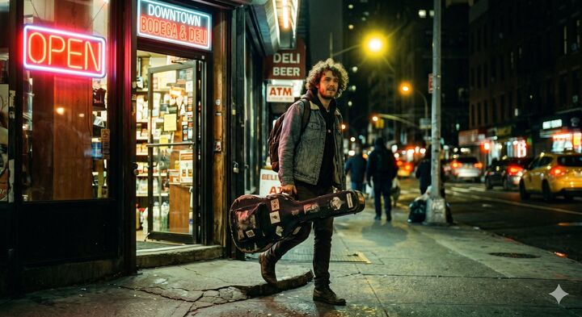

## Original prompt

A candid, magazine-cover quality documentary photograph of a young musician with curly hair, casually carrying a worn guitar case, stepping out of a classic downtown bodega at 11 PM. The lighting features a complex mixed color temperature: a bright neon "OPEN" sign casts an intense, warm red glow across his face, while a yellow streetlamp provides a striking backlight behind him. The image perfectly emulates 35mm film shot on a Canon AE-1 with a 50mm f/1.4 lens wide open, exhibiting a shallow depth of field with the background beautifully blurred. It captures the exact aesthetics of CineStill 800T film, specifically featuring the distinctive soft red halation bloom radiating outward from the neon light sources, a tungsten white balance, and moody, slightly green-tinted shadows in the darkest areas. Cinematic night photography, photorealistic, highly detailed.

## Run via Claude Code

After installing `Claude Code-GPT-IMAGE2-SeeDance-BlockRun`, you can adapt this case
into one of the bundle's commands. Closest match for this case based on
detected tags: `/headshot`.

```text
# Suggested invocation (manual prompt — wire into a command in v1.1+)
> Use the prompt above with mcp__blockrun__blockrun_image, model=openai/gpt-image-2,
  action=generate.
```

## Credit & license

Sourced from [awesome-gpt-image-2-prompts](https://github.com/EvoLinkAI/awesome-gpt-image-2-prompts/blob/main/cases/portrait.md) by EvoLinkAI.
This case file is part of the curated `prompts/case-library/` in the
[Claude Code-GPT-IMAGE2-SeeDance-BlockRun](https://github.com/BlockRunAI/Claude-Code-GPT-IMAGE2-SeeDance-BlockRun)
bundle. Reproduced with attribution; original license applies.
