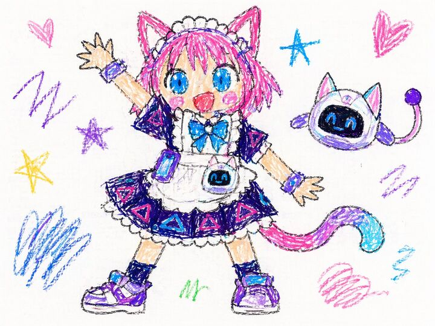

## Original prompt

(被写体) in the style of super bad child drawing, toddler art, scribbles, messy crayon lines on white background, completely lack of technique, terrible composition, chaotic colors, barely recognizable shapes, very raw, honest art, pure naivety, unrefined style, 4:3
Negative:
good drawing, nice lines, clear shapes, neat, pretty, smooth, realistic, talented art, coherent composition, artistic style, professional, skilled, masterpiece, beautiful, detailed

## Run via Claude Code

After installing `Claude Code-GPT-IMAGE2-SeeDance-BlockRun`, you can adapt this case
into one of the bundle's commands. Closest match for this case based on
detected tags: `/headshot`.

```text
# Suggested invocation (manual prompt — wire into a command in v1.1+)
> Use the prompt above with mcp__blockrun__blockrun_image, model=openai/gpt-image-2,
  action=generate.
```

## Credit & license

Sourced from [awesome-gpt-image-2-prompts](https://github.com/EvoLinkAI/awesome-gpt-image-2-prompts/blob/main/cases/portrait.md) by EvoLinkAI.
This case file is part of the curated `prompts/case-library/` in the
[Claude Code-GPT-IMAGE2-SeeDance-BlockRun](https://github.com/BlockRunAI/Claude-Code-GPT-IMAGE2-SeeDance-BlockRun)
bundle. Reproduced with attribution; original license applies.
