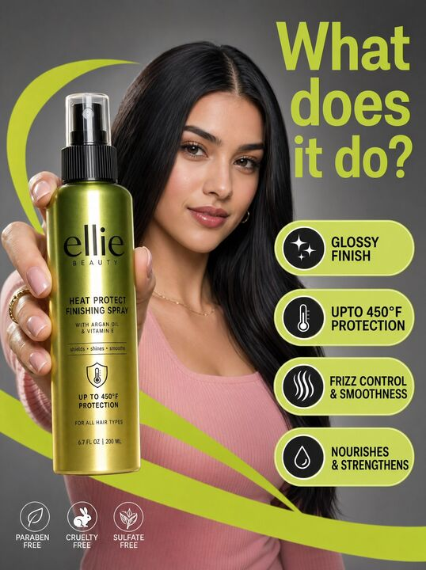

## Original prompt

A high-resolution commercial marketing photograph features a young woman with sleek dark hair and a pink ribbed top in a neutral grey studio setting, centered behind a glossy Ellie Beauty spray bottle held prominently in the foreground. The composition is energized by vibrant, lime-green graphic "swooshes" and floating pill-shaped callouts that highlight product features like "glossy finish" and "upto 450°F protection" in bold black sans-serif text. The lighting is professionally diffused, casting soft highlights on the model’s face while creating a sharp, vertical reflection on the metallic green-to-gold gradient bottle label. Topping the scene is a large, lime-green headline in the upper right asking, "What does it do?", altogether creating a clean, modern, and high-contrast aesthetic with a shallow depth of field that keeps the product and the model's focused expression in sharp relief.

## Run via Claude Code

After installing `Claude Code-GPT-IMAGE2-SeeDance-BlockRun`, you can adapt this case
into one of the bundle's commands. Closest match for this case based on
detected tags: `/ad-series (v1.2)`.

```text
# Suggested invocation (manual prompt — wire into a command in v1.1+)
> Use the prompt above with mcp__blockrun__blockrun_image, model=openai/gpt-image-2,
  action=generate.
```

## Credit & license

Sourced from [awesome-gpt-image-2-prompts](https://github.com/EvoLinkAI/awesome-gpt-image-2-prompts/blob/main/cases/ui.md) by EvoLinkAI.
This case file is part of the curated `prompts/case-library/` in the
[Claude Code-GPT-IMAGE2-SeeDance-BlockRun](https://github.com/BlockRunAI/Claude-Code-GPT-IMAGE2-SeeDance-BlockRun)
bundle. Reproduced with attribution; original license applies.
