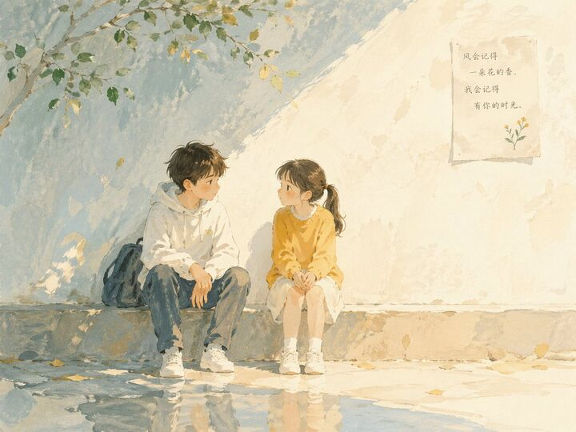

## Original prompt

Soft poetic children's book illustration with watercolor and gouache textures.Clear gentle daylight with slightly brighter highlights.Muted pastel colors with soft blue and warm tones.Visible brush strokes and paper grain.Minimalist composition with large negative space.Calm, thoughtful, slightly open-ended atmosphere.

Child character (around 12 years old).Subtle visual metaphors like light, shadow, perspective, reflection.Hand-painted picture book style, not cartoon, not anime, not 3D.

Two children in calm conversation,soft connection forming.

## Run via Claude Code

After installing `Claude Code-GPT-IMAGE2-SeeDance-BlockRun`, you can adapt this case
into one of the bundle's commands. Closest match for this case based on
detected tags: `/ad-series (v1.2)`.

```text
# Suggested invocation (manual prompt — wire into a command in v1.1+)
> Use the prompt above with mcp__blockrun__blockrun_image, model=openai/gpt-image-2,
  action=generate.
```

## Credit & license

Sourced from [awesome-gpt-image-2-prompts](https://github.com/EvoLinkAI/awesome-gpt-image-2-prompts/blob/main/cases/poster.md) by EvoLinkAI.
This case file is part of the curated `prompts/case-library/` in the
[Claude Code-GPT-IMAGE2-SeeDance-BlockRun](https://github.com/BlockRunAI/Claude-Code-GPT-IMAGE2-SeeDance-BlockRun)
bundle. Reproduced with attribution; original license applies.
