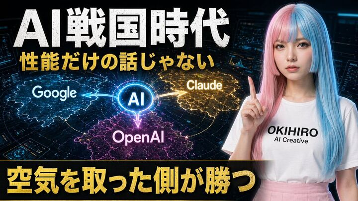

## Original prompt

A bold Japanese YouTube thumbnail about the AI competition era, 16:9 widescreen, high contrast, dramatic tech-news style. Use a dark futuristic control-room background filled with 3 glowing holographic dashboard screens and blue cyber interface elements around the edges. On the left and center, place a luminous circular hub labeled “AI” in bright blue, with 3 directional glowing energy arrows branching outward to competing platforms: “Google” on the left in a blue electric region, “Claude” on the upper right in a gold electric region, and “OpenAI” at the bottom center in a magenta-purple electric region. Add a subtle world-map or territory-battle visualization effect under each brand region, like illuminated digital land masses or influence zones. On the right side, show a young Japanese-looking woman from waist up, facing forward, wearing a long straight split-color wig with pastel pink on one side and pastel blue on the other, a plain white T-shirt with the printed text “OKIHIRO AI Creative”, and a light pink skirt. She raises one index finger beside her face in a presenter pose. Her face is fully obscured by a large soft-edged rectangular blur block. Across the top, add huge distressed white Japanese headline text: {argument name="headline text" default="AI戦国時代"}. Beneath it, add a second line in bold gold Japanese text: {argument name="subheadline text" default="性能だけの話じゃない"}. Across the bottom, place a wide black banner with massive bold gold Japanese text: {argument name="bottom text" default="空気を取った側が勝つ"}. Make the typography oversized, gritty, and attention-grabbing, with slight glow and drop shadow. Use a color palette of black, electric blue, gold, magenta, and neon white, with intense contrast and thumbnail readability.

## Run via Claude Code

After installing `Claude Code-GPT-IMAGE2-SeeDance-BlockRun`, you can adapt this case
into one of the bundle's commands. Closest match for this case based on
detected tags: `/ui-system (v1.1)`.

```text
# Suggested invocation (manual prompt — wire into a command in v1.1+)
> Use the prompt above with mcp__blockrun__blockrun_image, model=openai/gpt-image-2,
  action=generate.
```

## Credit & license

Sourced from [awesome-gpt-image-2-prompts](https://github.com/EvoLinkAI/awesome-gpt-image-2-prompts/blob/main/cases/comparison.md) by EvoLinkAI.
This case file is part of the curated `prompts/case-library/` in the
[Claude Code-GPT-IMAGE2-SeeDance-BlockRun](https://github.com/BlockRunAI/Claude-Code-GPT-IMAGE2-SeeDance-BlockRun)
bundle. Reproduced with attribution; original license applies.
