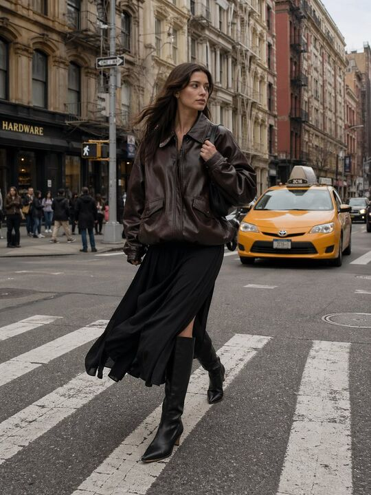

## Original prompt

Un póster publicitario surrealista de alta costura para Aguardiente Amarillo. La escena se sitúa en un estudio minimalista y monocromático de color naranja claro, con un suelo semirreflectante.
El foco central es una botella de Aguardiente Amarillo de tamaño descomunal y gigante, colocada en ángulo diagonal y que sirve como respaldo. Un modelo masculino de moda, de cabello largo y oscuro, vestido con un conjunto impecable y totalmente blanco —compuesto por una sudadera y pantalones de pierna ancha—, apoya toda su espalda contra la botella gigante en una postura relajada e inclinada. Mira hacia la derecha, de perfil, con la vista al frente y una expresión serena; calza zapatillas blancas de tamaño estándar.
En el fondo, la palabra "AGUARDIENTE" aparece escrita con una tipografía sans-serif condensada, blanca, masiva y en negrita, parcialmente oculta por la botella gigante y por el modelo para crear una sensación de profundidad. En la esquina superior derecha se lee: "Creado por @HMontilla_".
En la parte inferior central, una frase publicitaria en tipografía sans-serif blanca reza: "El Aguardiente Amarillo de Manzanares es un icónico licor colombiano, originario de 1885 en Manzanares, Caldas". La iluminación es suave, fría y uniforme, proyectando sombras tenues y un reflejo sutil de los sujetos sobre el suelo azul brillante. La estética general es limpia, moderna y de alto concepto.

Establecer la relación de aspecto en 3:4.

## Run via Claude Code

After installing `Claude Code-GPT-IMAGE2-SeeDance-BlockRun`, you can adapt this case
into one of the bundle's commands. Closest match for this case based on
detected tags: `/poster`.

```text
# Suggested invocation (manual prompt — wire into a command in v1.1+)
> Use the prompt above with mcp__blockrun__blockrun_image, model=openai/gpt-image-2,
  action=generate.
```

## Credit & license

Sourced from [awesome-gpt-image-2-prompts](https://github.com/EvoLinkAI/awesome-gpt-image-2-prompts/blob/main/cases/poster.md) by EvoLinkAI.
This case file is part of the curated `prompts/case-library/` in the
[Claude Code-GPT-IMAGE2-SeeDance-BlockRun](https://github.com/BlockRunAI/Claude-Code-GPT-IMAGE2-SeeDance-BlockRun)
bundle. Reproduced with attribution; original license applies.
