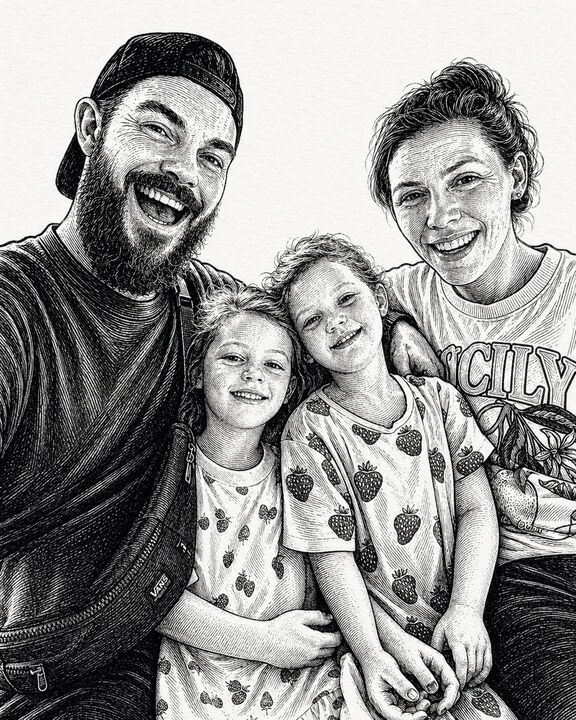

## Original prompt

A black-and-white hand-drawn family portrait in the style of detailed pen-and-ink crosshatching on textured white paper, showing 4 people seated closely together in a casual candid composition. On the left, an adult man in a dark baseball cap worn backward and a dark T-shirt leans into the frame, with a crossbody sling bag worn across his chest and visible zipper details. On the right, an adult woman with curly hair tied up in a loose high bun wears a light T-shirt with large collegiate block letters reading {argument name="shirt text" default="CITY"}. In the center are 2 young children sitting close together, both with short curly hair and matching light-colored T-shirts printed all over with strawberries. The child on the left leans inward with one arm crossing the other child, and the child on the right tilts their head slightly upward. The adults frame the children protectively, creating a warm family snapshot feeling. Render the whole image as a monochrome etched illustration with dense fine-line hatching, engraved shadows, crisp contour lines, and a realistic yet artistic likeness, with no color, no background setting beyond a plain light paper texture, and a vertical portrait crop.

## Run via Claude Code

After installing `Claude Code-GPT-IMAGE2-SeeDance-BlockRun`, you can adapt this case
into one of the bundle's commands. Closest match for this case based on
detected tags: `/headshot`.

```text
# Suggested invocation (manual prompt — wire into a command in v1.1+)
> Use the prompt above with mcp__blockrun__blockrun_image, model=openai/gpt-image-2,
  action=generate.
```

## Credit & license

Sourced from [awesome-gpt-image-2-prompts](https://github.com/EvoLinkAI/awesome-gpt-image-2-prompts/blob/main/README.md) by EvoLinkAI.
This case file is part of the curated `prompts/case-library/` in the
[Claude Code-GPT-IMAGE2-SeeDance-BlockRun](https://github.com/BlockRunAI/Claude-Code-GPT-IMAGE2-SeeDance-BlockRun)
bundle. Reproduced with attribution; original license applies.
