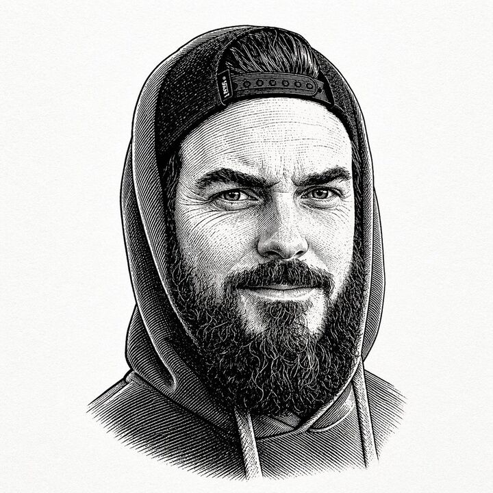

## Original prompt

A centered black-and-white vintage engraved portrait of a bearded man wearing a hooded sweatshirt with the hood up and a backward snapback cap visible under the hood. Show only the upper torso and head against a plain off-white paper background with subtle texture. Render the image in detailed pen-and-ink etching style with dense cross-hatching, fine parallel lines, and old book illustration shading. The figure faces forward in a calm, neutral pose. The cap has a visible snap closure band across the forehead area, slicked-back hair is visible above it, and a thick full beard extends below the face. The hoodie has two drawstrings hanging down at the chest. Keep the composition symmetrical and tightly framed like a classic engraved bust portrait, with no color, no modern graphic elements, and no background objects.

## Run via Claude Code

After installing `Claude Code-GPT-IMAGE2-SeeDance-BlockRun`, you can adapt this case
into one of the bundle's commands. Closest match for this case based on
detected tags: `/headshot`.

```text
# Suggested invocation (manual prompt — wire into a command in v1.1+)
> Use the prompt above with mcp__blockrun__blockrun_image, model=openai/gpt-image-2,
  action=generate.
```

## Credit & license

Sourced from [awesome-gpt-image-2-prompts](https://github.com/EvoLinkAI/awesome-gpt-image-2-prompts/blob/main/cases/portrait.md) by EvoLinkAI.
This case file is part of the curated `prompts/case-library/` in the
[Claude Code-GPT-IMAGE2-SeeDance-BlockRun](https://github.com/BlockRunAI/Claude-Code-GPT-IMAGE2-SeeDance-BlockRun)
bundle. Reproduced with attribution; original license applies.
