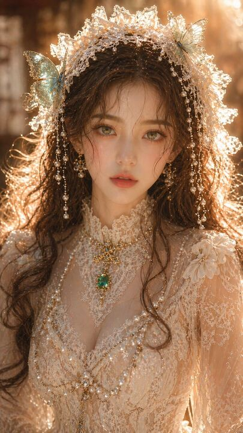

## Original prompt

{argument name="subject" default="Dreamy Oriental female portrait"}, adult female, close-up portrait, exquisite facial features, fair and translucent skin, delicate but clean skin texture, emerald green eyes, soft and charming gaze, brown wavy hair falling naturally; {argument name="accessories" default="Off-white lace headpiece"}, embellished with turquoise butterflies and pearl decorations; attire is an exquisite lace gown with a clear structure and clean, not overly complex texture, accompanied by emerald jewelry; lighting is soft warm gold side-backlighting, rim lighting is clear but not overexposed, skin has slight highlights but not excessive reflection, overall lighting is clean and transparent, background is softly blurred with shallow depth of field; high-end portrait photography quality, details are clear but restrained, no grain, no noise, real physical lighting, 8K, commercial-grade quality. Aspect ratio: 9:16

## Run via Claude Code

After installing `Claude Code-GPT-IMAGE2-SeeDance-BlockRun`, you can adapt this case
into one of the bundle's commands. Closest match for this case based on
detected tags: `/headshot`.

```text
# Suggested invocation (manual prompt — wire into a command in v1.1+)
> Use the prompt above with mcp__blockrun__blockrun_image, model=openai/gpt-image-2,
  action=generate.
```

## Credit & license

Sourced from [awesome-gpt-image-2-prompts](https://github.com/EvoLinkAI/awesome-gpt-image-2-prompts/blob/main/cases/portrait.md) by EvoLinkAI.
This case file is part of the curated `prompts/case-library/` in the
[Claude Code-GPT-IMAGE2-SeeDance-BlockRun](https://github.com/BlockRunAI/Claude-Code-GPT-IMAGE2-SeeDance-BlockRun)
bundle. Reproduced with attribution; original license applies.
