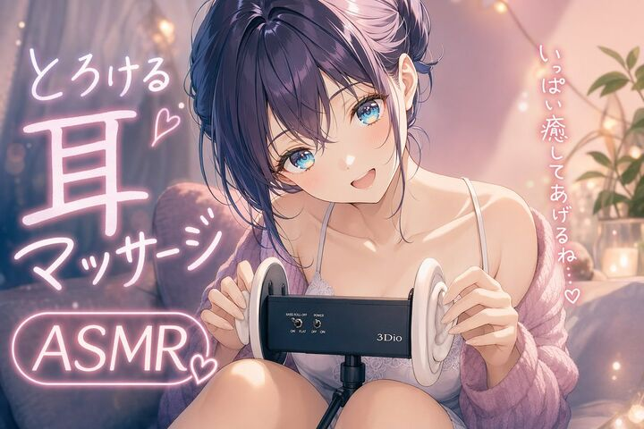

## Original prompt

A soft, dreamy anime illustration of a cute young woman doing ASMR in a cozy bedroom at night, seated close to the viewer with her knees pulled up and a black 3Dio-style binaural microphone centered in front of her. She has {argument name="hair color" default="deep violet"} hair in a loose messy updo with wispy bangs framing her face, large sparkling {argument name="eye color" default="blue"} eyes, a gentle blush, and a sweet open-mouth smile. Her head is tilted slightly toward the viewer in a warm, affectionate pose. She wears a delicate white lace camisole with thin straps and an oversized fluffy knit cardigan in {argument name="cardigan color" default="soft pink-lavender"} draped off her shoulders, creating a tender, intimate late-night healing atmosphere. Both hands lightly touch the white silicone ears of the microphone as if about to give an ear massage. The room is softly lit with pink and amber ambient lighting, heavy curtains in the background, a bed or sofa with plush cushions, warm fairy-light bokeh, and a small plant on the right side. Add glowing handwritten Japanese neon text integrated into the composition: on the left, 4 text elements reading "とろける", "耳", "マッサージ", and "ASMR" with 2 small heart symbols; on the right, vertical text reading "いっぱい癒してあげるね...♡". Use a polished modern anime style, highly detailed face and hair, glossy eyes, smooth luminous skin, soft shading, pastel highlights, shallow depth of field, romantic cozy streamer-thumbnail composition, and a soothing feminine color palette dominated by pink, lavender, cream, and warm gold.

## Run via Claude Code

After installing `Claude Code-GPT-IMAGE2-SeeDance-BlockRun`, you can adapt this case
into one of the bundle's commands. Closest match for this case based on
detected tags: `/ad-series (v1.2)`.

```text
# Suggested invocation (manual prompt — wire into a command in v1.1+)
> Use the prompt above with mcp__blockrun__blockrun_image, model=openai/gpt-image-2,
  action=generate.
```

## Credit & license

Sourced from [awesome-gpt-image-2-prompts](https://github.com/EvoLinkAI/awesome-gpt-image-2-prompts/blob/main/cases/ui.md) by EvoLinkAI.
This case file is part of the curated `prompts/case-library/` in the
[Claude Code-GPT-IMAGE2-SeeDance-BlockRun](https://github.com/BlockRunAI/Claude-Code-GPT-IMAGE2-SeeDance-BlockRun)
bundle. Reproduced with attribution; original license applies.
