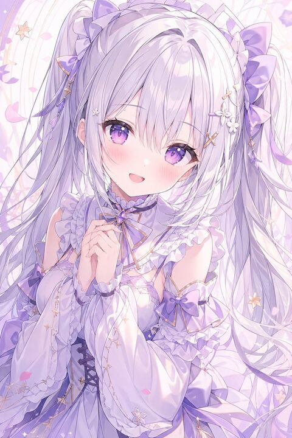

## Original prompt

A delicate vertical anime portrait of a dreamy young woman in an ethereal pastel lavender palette, shown from about mid-thigh up against a soft decorative background of pale swirling lines, floating petals, tiny stars, and subtle sparkles. She has extremely long, voluminous silver-lilac hair styled in twin tails with flowing strands, soft bangs, and ornate ribbon decorations; each side is adorned with large lavender bows, ruffled headband-like trim, dangling gold star charms, and small white flower hair ornaments. Her face is centered and mostly covered by a flat solid pale lavender rectangle censor block, leaving only hints of her ears and hairline visible. She wears an elaborate fantasy-lolita inspired dress in white, pearl, and light violet, with glossy satin fabric, ruffled neckline, layered frills, puffed detached sleeves, gold trim, corset lacing at the waist, and multiple purple bows including 3 clearly visible bow accents on the outfit. Her hands are clasped gently near her chest in a shy, elegant pose. The image should feel soft, refined, feminine, and luminous, with high-detail anime rendering, smooth gradients, airy composition, flowing hair movement, and a romantic celestial aesthetic. Use a {argument name="color theme" default="pastel lavender and white"} palette, {argument name="hair color" default="silver-lilac"} hair, an {argument name="outfit style" default="ornate fantasy lolita dress with bows and ruffles"} design, a {argument name="background style" default="soft swirls, petals, stars, and sparkles"} backdrop, and a {argument name="face covering" default="solid pale lavender censor rectangle"} over the face.

## Run via Claude Code

After installing `Claude Code-GPT-IMAGE2-SeeDance-BlockRun`, you can adapt this case
into one of the bundle's commands. Closest match for this case based on
detected tags: `/headshot`.

```text
# Suggested invocation (manual prompt — wire into a command in v1.1+)
> Use the prompt above with mcp__blockrun__blockrun_image, model=openai/gpt-image-2,
  action=generate.
```

## Credit & license

Sourced from [awesome-gpt-image-2-prompts](https://github.com/EvoLinkAI/awesome-gpt-image-2-prompts/blob/main/cases/portrait.md) by EvoLinkAI.
This case file is part of the curated `prompts/case-library/` in the
[Claude Code-GPT-IMAGE2-SeeDance-BlockRun](https://github.com/BlockRunAI/Claude-Code-GPT-IMAGE2-SeeDance-BlockRun)
bundle. Reproduced with attribution; original license applies.
