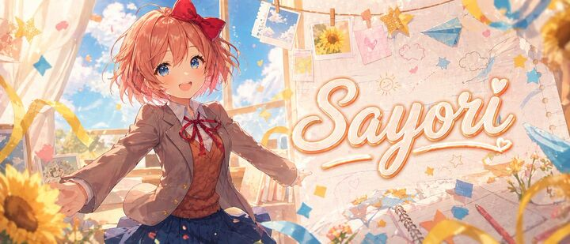

## Original prompt

A wide anime banner illustration of {argument name="character name" default="Sayori"} in a bright dreamy classroom, rendered in a polished, high-end visual novel style with soft painterly lighting, warm pastel colors, and sparkling atmosphere. Show a cheerful teenage schoolgirl with short fluffy coral-pink hair, messy bob layers, and a large red bow on the right side of her head, wearing a Japanese school uniform with a light brown blazer, white shirt, red ribbon tie, brown sweater vest, and pleated navy skirt. She stands slightly left of center with arms open wide in an inviting, joyful pose, as if welcoming the viewer, with dynamic perspective and gentle motion in her hair and clothes. Her face is intentionally obscured by a flat rectangular skin-tone censor block. Behind her, tall classroom windows reveal a vivid blue sky with soft white clouds and warm sunlight streaming in. The right half of the image features a large decorative handwritten script reading {argument name="headline text" default="Sayori"}, cream-white lettering with a soft orange-gold outline and glow, integrated into a scrapbook-like wall background. Surround the scene with hanging photo prints clipped to string, including sky photos and a sunflower photo, plus hand-drawn doodles of clouds, stars, hearts, and a sun. Add blue and yellow paper stars, ribbons, floating confetti, a blue paper airplane, notebook pages, a spiral sketchbook, and scattered stationery elements. Place sunflowers prominently in the foreground and edges, with warm golden bokeh and soft depth of field. Make the composition energetic, cute, nostalgic, and emotionally uplifting, like a premium anime-themed YouTube banner or character tribute header, ultra-detailed, clean, stylish, luminous, and impact-focused.

## Run via Claude Code

After installing `Claude Code-GPT-IMAGE2-SeeDance-BlockRun`, you can adapt this case
into one of the bundle's commands. Closest match for this case based on
detected tags: `/ad-series (v1.2)`.

```text
# Suggested invocation (manual prompt — wire into a command in v1.1+)
> Use the prompt above with mcp__blockrun__blockrun_image, model=openai/gpt-image-2,
  action=generate.
```

## Credit & license

Sourced from [awesome-gpt-image-2-prompts](https://github.com/EvoLinkAI/awesome-gpt-image-2-prompts/blob/main/cases/ui.md) by EvoLinkAI.
This case file is part of the curated `prompts/case-library/` in the
[Claude Code-GPT-IMAGE2-SeeDance-BlockRun](https://github.com/BlockRunAI/Claude-Code-GPT-IMAGE2-SeeDance-BlockRun)
bundle. Reproduced with attribution; original license applies.
