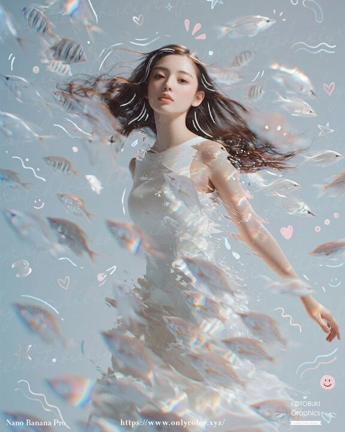

## Original prompt

A dreamy surreal portrait of a {argument name="subject" default="young woman"} standing underwater or in a liquid-like ethereal space, shown from about mid-thigh up, wearing a flowing sleeveless white dress that appears to dissolve into translucent water and shimmering fragments. Her long {argument name="hair color" default="dark brown"} hair streams dramatically sideways as if suspended in water, and her face is intentionally obscured by a soft vertical blur block for anonymity. Surround her with an exact count of about 30 small translucent fish, some striped and some pale silvery white, swimming in multiple depths of field across the foreground, midground, and background, with several fish passing in front of her body and hair to create strong motion and depth. Use a soft pastel {argument name="background color" default="powder blue"} background with faint handwritten script texture layered across it, plus whimsical doodles scattered throughout: white and pale pink hearts, stars, curved squiggles, wave lines, dots, sparkles, and 2 smiley faces. Add prismatic rainbow refractions, glossy caustic highlights, and subtle lens-like chromatic shimmer on the fish and dress. The mood should feel delicate, introspective, airy, and magical, with high-key lighting, gentle contrast, soft focus in the foreground, and crisp detail on the torso and hair. Compose the figure slightly off-center with one arm relaxed downward and the body turned lightly in motion, as if drifting peacefully through a school of fish. Include tiny elegant footer text in white near the bottom edge, with a left signature, a centered website URL, and a small right credit mark, resembling an art-poster or social-media showcase image.

## Run via Claude Code

After installing `Claude Code-GPT-IMAGE2-SeeDance-BlockRun`, you can adapt this case
into one of the bundle's commands. Closest match for this case based on
detected tags: `/headshot`.

```text
# Suggested invocation (manual prompt — wire into a command in v1.1+)
> Use the prompt above with mcp__blockrun__blockrun_image, model=openai/gpt-image-2,
  action=generate.
```

## Credit & license

Sourced from [awesome-gpt-image-2-prompts](https://github.com/EvoLinkAI/awesome-gpt-image-2-prompts/blob/main/README.md) by EvoLinkAI.
This case file is part of the curated `prompts/case-library/` in the
[Claude Code-GPT-IMAGE2-SeeDance-BlockRun](https://github.com/BlockRunAI/Claude-Code-GPT-IMAGE2-SeeDance-BlockRun)
bundle. Reproduced with attribution; original license applies.
